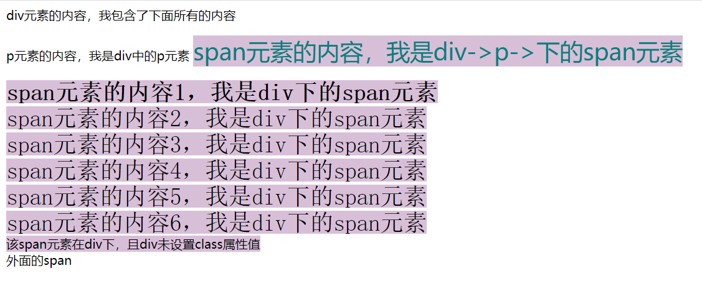
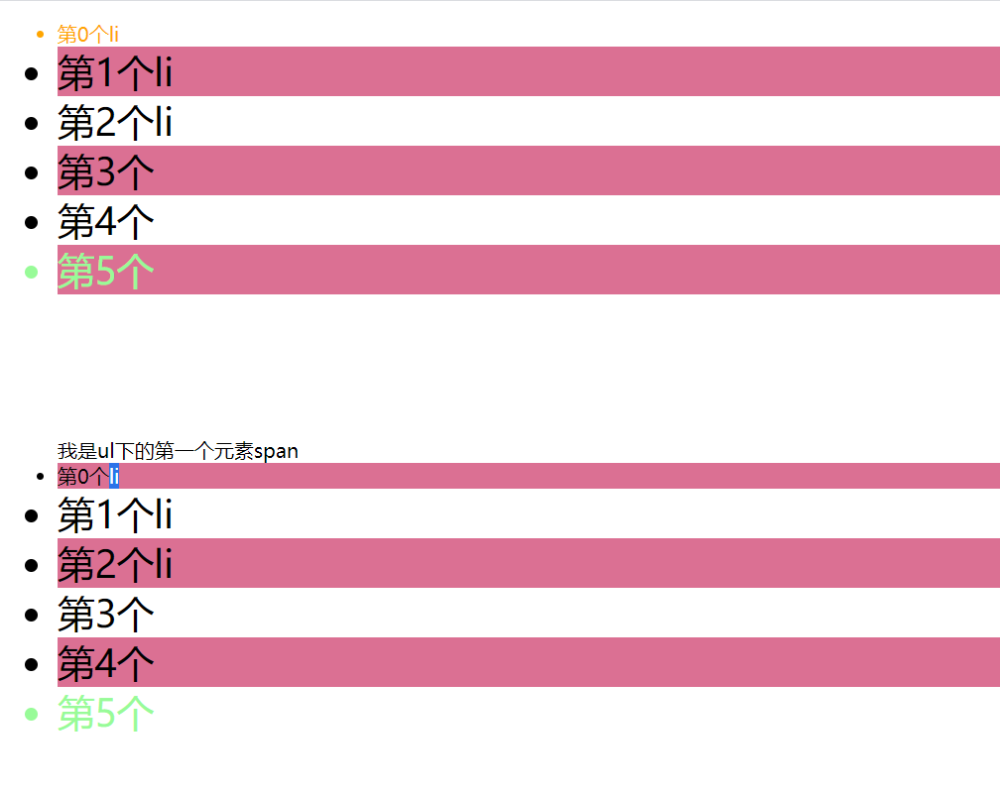

## 1.常用选择器

| 名称       | 作用                              | 语法         | 例子     |
| ---------- | --------------------------------- | ------------ | -------- |
| 元素选择器 | 根据标签名来选中指定元素          | 标签名{}     | p {}     |
| id选择器   | 根据元素的id属性值选中一个元素    | #id属性值{}  | #demo {} |
| 类选择器   | 根据元素的class属性值选中一组元素 | .class属性值 | .blue {} |
| 通配选择器 | 选中页面中的所有元素              | *{}          | *{}      |

>注意：class是一个标签的属性，它和id类似，不同的是class可以重复使用
>
>可以通过class属性来为元素分组
>
>可以同时为一个元素指定多个class属性

```html
<!DOCTYPE html>
<html lang="en">
<head>
    <meta charset="UTF-8">
    <meta http-equiv="X-UA-Compatible" content="IE=edge">
    <meta name="viewport" content="width=device-width, initial-scale=1.0">
    <title>常用选择器</title>
    <style>
        p{
            color: brown;
        }

        #demo{
            color: aquamarine;
        }

        .blue{
            color: blue;
        }

        *{
            color: darkgoldenrod;
            background-color: darkgreen;
        }
    </style>
</head>
<body>
    <p>段落1，元素选择器</p>

    <p id="demo">使用id选择器</p>

    <p class="blue">通过class属性设置元素分组1</p>
    <p class="blue">通过class属性设置元素分组2</p>

    <h1>测试通配选择器，即*{}表示的内容</h1>
    <h2>axcnanjs</h2>
</body>
</html>

```


## 2.复合选择器

| 名称       | 作用                         | 语法                        | 例子       |
| ---------- | ---------------------------- | --------------------------- | ---------- |
| 交集选择器 | 选中同时复合多个条件的元素   | .选择器1.选择器2.选择器n{}  |            |
| 并集选择器 | 同时选择多个选择器对应的元素 | 选择器1，选择器2，选择器n{} | h1,span {} |

> 注意：交集选择器中如果有元素选择器，必须使用元素选择器开

```html
<!DOCTYPE html>
<html lang="en">
<head>
    <meta charset="UTF-8">
    <meta http-equiv="X-UA-Compatible" content="IE=edge">
    <meta name="viewport" content="width=device-width, initial-scale=1.0">
    <title>复合选择器</title>
    <style>
        .red{
            color: red;
            background-color: royalblue;
        }

        /* 选中div元素和class属性为red的交集 */
        div.red{
            font-size: 30px;
        }
        p.red{
            font-size: 50px;
        }
        /* 可以为class属性设置多个值，选中同时复合条件的元素 */
        .red2.a.b{
            background-color: saddlebrown;
        }
        /* div#demo 即选中div中id为demo的元素，多此一举，id即可唯一标识 */

        /* 并集选择器,同时选择h1和span元素，同时为两个元素设置属性 */
        h1, span{
            color: skyblue;
            background-color: slategray;
        }
        /* 并集选择器可以无限组合 */
        #demo,.red2.a,h1,span,div.red{
            font-family: cursive;
        }
    </style>
</head>
<body>
   <div class="red">我是一个div并且class属性为red</div> 

   <p class="red">我是一个p元素，且class属性为red</p>

   <div class="red2 a b c d ">我是第二个div，且class属性为red2 a b c d</div>
    
   <h1 id="demo">标题</h1>
   <span>测试并集选择器</span>
</body>
</html>
```


## 3.关系选择器

| 名称           | 作用                         | 语法                                | 例子        |
| -------------- | ---------------------------- | ----------------------------------- | ----------- |
| 子元素选择器   | 选中所指定父元素的指定子元素 | 父元素 > 子元素                     | div > p {}  |
| 后代元素选择器 | 选中所指定                   | 祖先元素 后代元素                   | div p {}    |
| 兄弟元素选择器 | 选中该元素紧挨着的下一个兄弟 | 前一个元素 + 后一个元素             | p + span {} |
| 兄弟元素选择器 | 选择该元素下边的所有兄弟     | 前一个元素 ~ 后一个元素 （兄 ~ 弟） | p ~ span {} |

> 父元素：直接包含子元素的元素叫做父元素
>
> 子元素：直接被父元素包含的元素叫做子元素
>
> 祖先元素：直接或间接包含后代的元素叫做祖先元素，一个元素的父元素也是它的祖先元素
>
> 后代元素：直接或间接被祖先元素包含的元素叫做后代元素，子元素也是后代元素
>
> 兄弟元素：拥有相同父元素的元素是兄弟元素

```html
<!DOCTYPE html>
<html lang="en">
<head>
    <meta charset="UTF-8">
    <meta http-equiv="X-UA-Compatible" content="IE=edge">
    <meta name="viewport" content="width=device-width, initial-scale=1.0">
    <title>关系选择器</title>
    <style>
        /* 子元素选择器 */
        /* div > p {
            color: steelblue;
        } */
        div > p > span {
            color: teal;
        }


        /* 后代元素选择器 */
        div span{
            background-color: thistle;
        }
        div.demo span{
            font-size: 30px;
        }

        /* 选择该元素紧挨着的下一个兄弟 */
        p + span {
            font-weight:900;
        }
        /* 选择该元素后面所有的兄弟 */
        p ~ span {
            font-family:monospace;
        }
    </style>
</head>
<body>
    <div class="demo">
        div元素的内容，我包含了下面所有的内容
        <p>
            p元素的内容，我是div中的p元素
            <span>span元素的内容，我是div->p->下的span元素</span>
            <br>
        </p>
        <span>span元素的内容1，我是div下的span元素</span>
        <br> 
        <span>span元素的内容2，我是div下的span元素</span>
        <br> 
        <span>span元素的内容3，我是div下的span元素</span>
        <br> 
        <span>span元素的内容4，我是div下的span元素</span>
        <br> 
        <span>span元素的内容5，我是div下的span元素</span>
        <br> 
        <span>span元素的内容6，我是div下的span元素</span>
        <br> 
    </div>
    <div>
        <span>该span元素在div下，且div未设置class属性值</span>
    </div>
    <span>外面的span</span>
</body>
</html>
```

>在VSCode中，写出ul>li加table键，可直接生成父子关系的ul和li标签；
>
>ul>li*n可生成一个ul标签和n个li标签；*
>
>*同理得，ul+ul*n则生成n个ul标签



## 4.属性选择器

| 语法             | 作用                           | 例子            |
| ---------------- | ------------------------------ | --------------- |
| [属性名]         | 选择含有指定属性的元素         | [title] {}      |
| [属性名=属性值]  | 选择含有指定属性和属性值的元素 | [title=abc] {}  |
| [属性名^=属性值] | 选择属性值以指定值开头的元素   | [title^=abc] {} |
| [属性名$=属性值] | 选择属性值以指定值结尾的元素   | [title$=abc] {} |
| [属性名=属性值]  | 选择属性值中含有指定值的元素   | [title=e] {}    |

```html
<!DOCTYPE html>
<html lang="en">
<head>
    <meta charset="UTF-8">
    <meta http-equiv="X-UA-Compatible" content="IE=edge">
    <meta name="viewport" content="width=device-width, initial-scale=1.0">
    <title>属性选择器</title>
    <style>
        /* p {
            color: rgb(224, 48, 48);
        } */
        p[title^=abc] {
            color: rgb(224, 48, 48);
        }
        p[title*=e] {
            background-color: burlywood;
        }
    </style>
</head>
<body>
    <p title="abc">这是p标签里的内容</p>
    <p title="abcdef">这是p标签里的内容</p>
    <p title="aksbd">这是p标签里的内容</p>
    <p title="ab">这是p标签里的内容</p>
    <p title="cbiuabc">这是p标签里的内容</p>
    <p title="hello abc">这是p标签里的内容</p>
</body>
</html>

```


## 5.伪类选择器

>伪类（不存在的类，特殊的类）：
>
>伪类用来描述一个元素的特殊状态，比如：第一个子元素、被点击的元素、鼠标移入的元素…
>
>伪类一般情况下都是使用:开头（且:前面不加空格）

下列伪类根据所有的子元素进行排序：

| 常用伪类     | 作用               |
| ------------ | ------------------ |
| :first-child | 选中第一个子元素   |
| :last-child  | 选中最后一个子元素 |
| :nth-child() | 选中第n个子元素    |

> 补充：
>
> n的范围指从0到正无穷；
>
> 2n或even表示选中偶数位的元素；
>
> 2n+1或odd表示选中奇数位的元素

下列伪类在同类型元素中进行排序

| 常用伪类       | 作用               |
| -------------- | ------------------ |
| :first-of-type | 选中第一个子元素   |
| :last-of-type  | 选中最后一个子元素 |
| :nth-of-type() | 选中第n个子元素    |

> 补充：
>
> :not()否定伪类，将符合条件的元素从选择器中除去，可与其他伪类嵌套使用

```html
<!DOCTYPE html>
<html lang="en">
<head>
    <meta charset="UTF-8">
    <meta http-equiv="X-UA-Compatible" content="IE=edge">
    <meta name="viewport" content="width=device-width, initial-scale=1.0">
    <title>伪类选择器</title>
    <style>
        ul > li:first-child{
            color: orange;
        }
        ul > li:last-child{
            color: palegreen;
        }
        ul > li:nth-child(even){
            background-color: palevioletred;
        }

        ul > li:not(:nth-of-type(1)){
            font-size: 30px;
        }
    </style>
</head>
<body>
    <ul>
        <li>第0个li</li>
        <li>第1个li</li>
        <li>第2个li</li>
        <li>第3个</li>
        <li>第4个</li>
        <li>第5个</li>
    </ul>
    <br>
    <br>
    <br>
    <br>
    <ul>
        <span>我是ul下的第一个元素span</span>
        <li>第0个li</li>
        <li>第1个li</li>
        <li>第2个li</li>
        <li>第3个</li>
        <li>第4个</li>
        <li>第5个</li>
    </ul>
</body>
</html>
```


