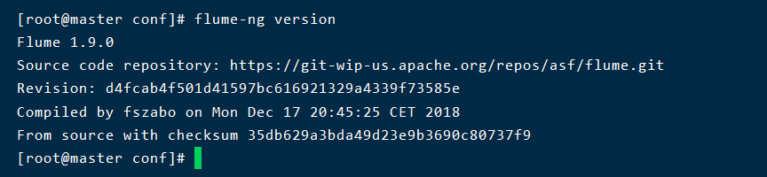

# `flume`安装步骤

1.下载并解压到`/usr/local`目录下

```shell
tar -zxvf /home/apache-flume-1.9.0-bin.tar.gz -C /usr/local/
```

2.修改名称

```shell
cd /usr/local
ls
mv apache-flume-1.9.0-bin/ flume
```

> 如果`Hadoop`是3.1.3版本，注意将 `lib `文件夹下的`guava-11.0.2.jar `删除，否则会不兼容。

3.进入`flume`下的`conf`目录，复制文件`flume-env.sh.template`为`flume-env.sh`，并在里面添加`JAVA_HOME`环境变量

```shell
cd /usr/local/flume/conf
cp flume-env.sh.template flume-env.sh
vi flume-env.sh

# 添加JAVA_HOME环境变量
export JAVA_HOME=/usr/local/java/jdk1.8.0_281
```

4.配置`flume`环境变量

```shell
vi ~/.bashrc
export PATH=$PATH:/usr/local/flume/bin
source ~/.bashrc
```

5.查看`flume`是否安装成功

```shell
flume-ng version
```



# 案例一

> 使用`flume`监听某个端口，使用`Netcat`向这个端口发送数据，`flume`将接受到的数据打印到控制台，即编写一个采集`netcat`源数据的采集方案`netcat-logger.conf`。其中，`Netcat`是一款`TCP/UDP`连接和监听的测试工具，主要用于网络传输和调试。

1.在`/usr/local/flume/conf`目录下创建`netcat-logger.conf`文件

编写采集方案：

```shell
# example.conf: A single-node Flume configuration

# Name the components on this agent
a1.sources = r1
a1.sinks = k1
a1.channels = c1

# Describe/configure the source
a1.sources.r1.type = netcat
a1.sources.r1.bind = localhost
a1.sources.r1.port = 44444

# Describe the sink
a1.sinks.k1.type = logger

# Use a channel which buffers events in memory
a1.channels.c1.type = memory
a1.channels.c1.capacity = 1000
a1.channels.c1.transactionCapacity = 100

# Bind the source and sink to the channel
a1.sources.r1.channels = c1
a1.sinks.k1.channel = c1
```

2.指定采集方案配置文件，启动`flume agent`去采集数据

```shell
cd /usr/local/flume
flume-ng agent -n a1 -c ./conf -f ./conf/netcat-logger.conf -Dflume.root.logger=INFO,console
```

3.打开新的终端，使用`netcat`连接到本主机44444端口，持续发送消息作为`flume`要采集的源数据

```shell
nc localhost 44444

#如果出现未找到命令，使用以下命令安装之后再尝试
yum install nc -y
```


# 案例二

> 使用`Flume`监控本地文件并将采集到的数据上传到`HDFS`。

1.编写采集方案

在`/usr/local/flume/conf`目录下创建`exec-hdfs.conf`文件

```shell
cd /usr/local/flume/conf
touch exec-hdfs.conf
vi exec-hdfs.conf
```

在采集方案中写入下列内容：

```shell
# Name the components on this agent
a1.sources = r1
a1.sinks = k1
a1.channels = c1

# Describe/configure the source
a1.sources.r1.type = exec
a1.sources.r1.command = tail -F /usr/local/flume/conf/app.log
a1.sources.r1.port = 44444

# Describe the sink
a1.sinks.k1.type = hdfs
a1.sinks.k1.hdfs.path = hdfs://127.0.0.1:9000/user/flume/logs
a1.sinks.k1.hdfs.fileType = DataStream

# Use a channel which buffers events in memory
a1.channels.c1.type = memory
a1.channels.c1.capacity = 1000
a1.channels.c1.transactionCapacity = 100

# Bind the source and sink to the channel
a1.sources.r1.channels = c1
a1.sinks.k1.channel = c1
```

2.启动`HDFS`，并在`/usr/local/flume/conf`目录下创建日志文件`app.log`

```shell
start-dfs.sh
cd /usr/local/flume/conf
touch app.log
```

3.指定采集方案，启动`flume agent`去采集数据

```shell
cd /usr/local/flume/conf
flume-ng agent -n a1 -c ./ -f ./exec-hdfs.conf -Dflume.root.logger=INFO,console
```

4.打开一个新的终端，向日志文件`app.log`中发送消息作为`flume`要采集的源数据

```shell
cd /usr/local/flume/conf
echo "123456" >> app.log
```

5.查看保存在`HDFS`中的数据

可以通过访问`Web`页面查看

也可以使用命令查看

```shell
hdfs dfs -ls /user/flume/logs
hdfs dfs -cat /user/flume/logs/FlumeData.1634172383937
```

# 案例三

> 案例说明：
>
> 使用`flume`监控多目录下的多个实时追加文件并将采集到的数据上传到`HDFS`
>
> 主要内容：
>
> - `Taildir Source`的使用
> - `HDFS Sink`的使用
>
> 解决的主要问题：
>
> 实现断点续传，避免重复消费
>
> 监控多目录下多个追加文件的实时更新

