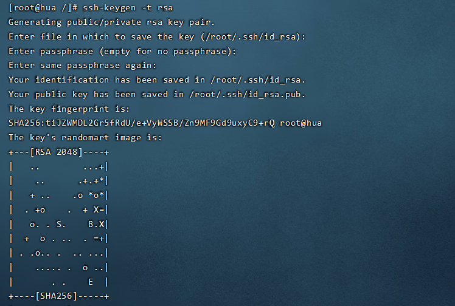

>转载自：
>
>文章作者: Huafire
>
>文章链接: http://likanghua.gitee.io/posts/1be7f29f.html

# 准 备：

> 三台服务器使用的操作系统为：Centos7
>
> Java环境为：jdk1.8
>
> Hadoop版本为：hadoop-3.1.4

# 思路：

> 1.规划好三台服务器中的master节点和slave节点
>
> 2.确保三台服务器都配置好Java环境
>
> 3.修改三台服务器的hosts文件并修改服务器的主机名
>
> 4.免密登录
>
> - 三台服务器都能够本机免密登录
> - 配置master本机无密码登录slave1、slave2
> - 配置slave1、slave2都能够本机无密码登录master
>
> 5.Hadoop环境搭建

# 步骤：

## 1.规划三台服务器的master节点和slave节点

| master | 112.74.82.83   |
| ------ | -------------- |
| slave1 | 182.92.113.245 |
| slave2 | 8.136.206.177  |

## 2.配置三台服务器的Java环境

卸载已安装的`OpenJDK`

```shell
rpm -qa | grep java
```

将带有`openjdk`的全部删除，例如：

```shell
yum -y remove java-1.7.0-openjdk-1.7.0.141-2.6.10.5.el7.x86_64
```

进入`/usr/local/`目录下，并创建`java`文件夹

```shell
cd /usr/local
mkdir java
cd java
```

将准备好的安装包解压到当前文件夹下

```shell
tar -zxvf /home/jdk-8u161-linux-x64.tar.gz -C ./
```

编辑`/etc/profile/`文件

```shell
vim /etc/profile
```

在文件尾部加入如下配置

```shell
JAVA_HOME=/usr/local/java/jdk1.8.0_281
CLASSPATH=$JAVA_HOME/lib/
PATH=$PATH:$JAVA_HOME/bin
export PATH JAVA_HOME CLASSPATH
```

刷新环境便变量，使其立即生效

```shell
source /etc/profile
```

查看是否配置成功

```shell
[root@hui java]# java -version
java version "1.8.0_281"
Java(TM) SE Runtime Environment (build 1.8.0_281-b09)
Java HotSpot(TM) 64-Bit Server VM (build 25.281-b09, mixed mode)
```

## 3.修改hosts`文件和主机名

修改`hosts`文件，在里面添加如下内容，将IP地址起个名字

```shell
[root@hui ~]# vim /etc/hosts
```

```shell
112.74.82.83    master
182.92.113.245  slave1
8.136.206.177   slave2
```

修改后使用`ping`，测试一下。测试成功，使用`Ctrl+C`停止命令。

```shell
[root@hui ~]# ping slave1
PING slave1 (182.92.113.245) 56(84) bytes of data.
64 bytes from slave1 (182.92.113.245): icmp_seq=1 ttl=56 time=46.7 ms
64 bytes from slave1 (182.92.113.245): icmp_seq=2 ttl=56 time=46.6 ms
64 bytes from slave1 (182.92.113.245): icmp_seq=3 ttl=56 time=46.6 ms
64 bytes from slave1 (182.92.113.245): icmp_seq=4 ttl=56 time=46.6 ms
^C
--- slave1 ping statistics ---
4 packets transmitted, 4 received, 0% packet loss, time 3004ms
rtt min/avg/max/mdev = 46.657/46.699/46.785/0.269 ms
[root@hui ~]# 
```

使用下面的命令修改服务器的主机名

```shell
[root@hui ~]# hostnamectl set-hostname master
```

修改后断开连接，再重新连上会发现主机名已经改变了


## 4.免密登录

### 4.1本机免密登录

（以`master`节点为例，`slave1`和`slave2`按照同样的方法配置）

1.生产密钥

输入下面的命令，然后按几次回车

```shell
ssh-keygen -t rsa
```



执行完会在`/root/.ssh/`中看到`id_rsa`（私钥）和`id_rsa.pub`（公钥）

```shell
[root@master ~]# cd /root/.ssh/
[root@master .ssh]# ls
authorized_keys  id_rsa  id_rsa.pub
```

2.将公钥追加到`authorized_keys`文件

```shell
[root@master .ssh]# cat ~/.ssh/id_rsa.pub >> ~/.ssh/authorized_keys
```

3.赋予权限

```shell
 chmod 600 /root/.ssh/authorized_keys 
```

4.验证本机能无密码访问

```shell
ssh master
```

### 4.2配置`master`本机无密码登录`slave1、slave2`

（以`master`本机无密码登录`slave1`为例，按照同样的方法配置`slave2`）

1.登录`slave1`，复制`master`服务器的公钥`id_rsa.pub`到`slave1`服务器的`root`目录下

若`scp`命令无效，可手动复制

```shell
[root@slave1 ~]# scp root@master:/root/.ssh/id_rsa.pub /root/
```

2.将`master`的公钥（id_rsa.pub）追加到`slave1`的`authorized_keys`

```shell
[root@slave1 ~]# cat id_rsa.pub >> .ssh/authorized_keys
[root@slave1 ~]# rm -rf id_rsa.pub
```

3.在`master`上面测试

```shell
[root@master ~]# ssh slave1
```


### 4.3配置`slave1、slave2`本机无密码登录`master`

（以`slave1`本机无密码登录`smaster`为例，按照同样的方法配置`slave2`）

1.登录`master`，复制`slave1`服务器的公钥`id_rsa.pub`到`master`服务器的`/root`目录下

```shell
[root@master ~]# scp root@slave1:/root/.ssh/id_rsa.pub /root/
```

2.将`slave1`的公钥（id_rsa.pub）追加到`master`的`authorized_keys`中

```shell
[root@master ~]# cat id_rsa.pub >> .ssh/authorized_keys
[root@master ~]# rm -rf id_rsa.pub
```

3.在`slave1`上面测试

```shell
[root@slave1 ~]# ssh master
```


## 5.Hadoop环境搭建

### 5.1配置`master`上的`hadoop`环境

1.在`master`上解压`hadoop`安装包

```shell
#解压
[root@master local]# tar /home/hadoop/hadoop-3.1.4.tar.gz -C /usr/local/
#重命名
[root@master local]# mv hadoop-3.1.4/ hadoop
```

2.配置hadoop环境变量

编辑`/etc/profile/`文件

```shell
[root@master local]# vim /etc/profile
```

在文件最后添加如下两行

```shell
export HADOOP_HOME=/usr/local/hadoop
export PATH=$PATH:$HADOOP_HOME/bin
```

3.配置`core-site.xml`

该文件在`/usr/local/hadoop/etc/hadoop`下

在`<configuration></configuration>`标签之间添加如下内容

```xml
<configuration>
    <!--指定hadoop数据存储的临时文件夹-->
    <property>
        <name>hadoop.tmp.dir</name>
        <value>file:/usr/local/hadoop/tmp</value>
    </property>
    <!--指定NameNode的IP地址和端口号-->
    <property>
        <name>fs.defaultFS</name>
        <value>hdfs://master:9000</value>
    </property>
</configuration>
```

4.配置`hadoop-env.sh`

该文件在`/usr/local/hadoop/etc/hadoop`下

将`export JAVA_HOME=`后面加上自己的`jdk`路径

```sh
export JAVA_HOME=/usr/local/java/jdk1.8.0_281
```

5.配置`hdfs-site.xml`

该文件在`/usr/local/hadoop/etc/hadoop`下

在`<configuration></configuration>`标签之间添加如下内容

```xml
<configuration>

    <!-- namenode 上存储 hdfs 名字空间元数据-->
    <property>
        <name>dfs.namenode.name.dir</name>
        <value>/usr/local/hadoop/namenode</value>
    </property>

    <!-- datanode 上数据块的物理存储位置-->
    <property>
        <name>dfs.datanode.data.dir</name>
        <value>/usr/local/hadoop/datanode</value>
    </property>

    <!-- 设置 hdfs 副本数量 -->
    <property>
        <name>dfs.replication</name>
        <value>1</value>
    </property>
    
    <property>
  		<name>dfs.http.address</name>
  		<value>0.0.0.0:50070</value>
	</property>

</configuration>
```

6.配置`mapred-site.xml`

该文件在`/usr/local/hadoop/etc/hadoop`下

在`<configuration></configuration>`标签之间添加如下内容

```xml
<configuration>

    <!-- 指定yarn运行-->
    <property>
        <name>mapreduce.framework.name</name>
        <value>yarn</value>
    </property>

    <property>
        <name>yarn.app.mapreduce.am.env</name>
        <value>HADOOP_MAPRED_HOME=/usr/local/hadoop</value>
    </property>

    <property>
        <name>mapreduce.map.env</name>
        <value>HADOOP_MAPRED_HOME=/usr/local/hadoop</value>
    </property>

    <property>
        <name>mapreduce.reduce.env</name>
        <value>HADOOP_MAPRED_HOME=/usr/local/hadoop</value>
    </property>

</configuration>
```

7.配置`yarn-site.xml`

该文件在`/usr/local/hadoop/etc/hadoop`下

在`<configuration></configuration>`标签之间添加如下内容

```xml
<configuration>
<!-- Site specific YARN configuration properties -->
    <!-- 指定ResourceManager的地址 -->
    <property>
        <name>yarn.resourcemanager.hostname</name>
        <value>master</value>
    </property>

    <!-- reducer取数据的方式是mapreduce_shuffle -->  
    <property>
        <name>yarn.nodemanager.aux-services</name>
        <value>mapreduce_shuffle</value>
    </property>

</configuration>
```

8.配置`master`文件

```shell
vim /usr/local/hadoop/etc/hadoop/masters

#在里面添加namenode节点的主机名master
master
```

9.配置`slave`文件（`master`主机特有）

```shell
vim /usr/local/hadoop/etc/hadoop/workers

#在里面添加如下内容
master
slave1
slave2
```

10.配置`start-dfs.sh`和`stop-dfs.sh`

该文件在`/usr/local/hadoop/sbin`下

分别在`start-dfs.sh`he`stop-dfs.sh`文件的最前面添加如下内容

```sh
HDFS_DATANODE_USER=root
HDFS_DATANODE_SECURE_USER=hdfs
HDFS_NAMENODE_USER=root
HDFS_SECONDARYNAMENODE_USER=root
```

11.配置`start-yarn.sh`和`stop-yarn.sh`

该文件在`/usr/local/hadoop/sbin`下

分别在`start-yarn.sh`和`stop-yarn.sh`文件的最前面添加如下内容

```sh
YARN_RESOURCEMANAGER_USER=root
HADOOP_SECURE_DN_USER=yarn
YARN_NODEMANAGER_USER=root
```

### 5.2配置`slave`的`hadoop`环境变量

以`slave1`为例演示，`slave2`按照相同的方法配置

1.复制`hadoop`到`slave1`节点

```shell
[root@master ~]# scp -r /usr/local/hadoop slave1:/usr/local/
```

登录`slave1`服务器，删除`slaves`

```shell
[root@slave1 ~]# rm -rf /usr/local/hadoop/etc/hadoop/slaves
```

2.配置环境变量

编辑`/etc/profile`文件

```shell
[root@slave1 ~]# vim /etc/profile
```

在文件最后添加如下两行内容

```shell
export HADOOP_HOME=/usr/local/hadoop
export PATH=$PATH:$HADOOP_HOME/bin
```

刷新环境变量，使其立即生效

```shell
[root@slave1 ~]# source /etc/profile
```

### 5.3启动集群

1.格式化`namenode`

进入`master`的`/usr/local/hadoop/bin`目录下执行如下操作

```shell
[root@master bin]# ./hadoop namenode -format
```

2.启动`hadoop`

进入`/usr/local/hadoop/`目录下

```shell
[root@master hadoop]# sbin/start-all.sh
Starting namenodes on [master]
上一次登录：六 4月 17 21:14:36 CST 2021从 123.7.51.29pts/3 上
Starting datanodes
上一次登录：六 4月 17 21:16:00 CST 2021pts/0 上
localhost: Warning: Permanently added 'localhost' (ECDSA) to the list of known hosts.
Starting secondary namenodes [master]
上一次登录：六 4月 17 21:16:02 CST 2021pts/0 上
Starting resourcemanager
上一次登录：六 4月 17 21:16:05 CST 2021pts/0 上
Starting nodemanagers
上一次登录：六 4月 17 21:16:09 CST 2021pts/0 上
```

3.使用`jps`命令查看运行情况

```shell
[root@master hadoop]# jps
29840 ResourceManager
30499 Jps
30035 NodeManager
29047 NameNode
29516 SecondaryNameNode
```

```shell
[root@slave2 ~]# jps
31889 SecondaryNameNode
32407 NodeManager
31625 DataNode
25162 Jps
```

4.查看`hadoop`集群的状态

```shell
[root@master hadoop]# hadoop dfsadmin -report
```


5.`hadoop`重启

```shell
[root@master hadoop]# sbin/stop-all.sh 
Stopping namenodes on [master]
上一次登录：六 4月 17 21:17:12 CST 2021从 123.7.51.29pts/3 上
Stopping datanodes
上一次登录：六 4月 17 22:01:48 CST 2021pts/0 上
Stopping secondary namenodes [master]
上一次登录：六 4月 17 22:01:48 CST 2021pts/0 上
Stopping nodemanagers
上一次登录：六 4月 17 22:01:50 CST 2021pts/0 上
localhost: WARNING: nodemanager did not stop gracefully after 5 seconds: Trying to kill with kill -9
Stopping resourcemanager
上一次登录：六 4月 17 22:01:53 CST 2021pts/0 上
[root@master hadoop]# sbin/start-all.sh 
Starting namenodes on [master]
上一次登录：六 4月 17 22:01:59 CST 2021pts/0 上
Starting datanodes
上一次登录：六 4月 17 22:02:14 CST 2021pts/0 上
Starting secondary namenodes [master]
上一次登录：六 4月 17 22:02:16 CST 2021pts/0 上
Starting resourcemanager
上一次登录：六 4月 17 22:02:19 CST 2021pts/0 上
Starting nodemanagers
上一次登录：六 4月 17 22:02:23 CST 2021pts/0 上
```

配置成功后可在浏览器中输入`IP地址：端口号`，出现网页，查看是否配置成功。

# 错误：

配置之后在`master`节点使用`jps`命令，没有显示`namenode`

处理方法：

在master，slave1和slave2节点中/etc/hosts下，将master的ip改成私网ip，注意：只修改master的ip，slave1和slave2节点ip还是公网ip。重新格式化`namenode`，再次启动`hadoop`，使用`jps`命令查看。
