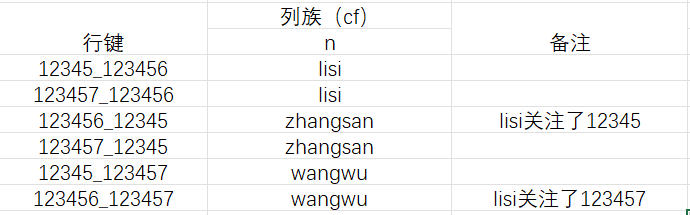
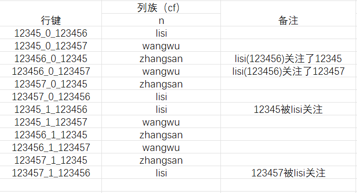
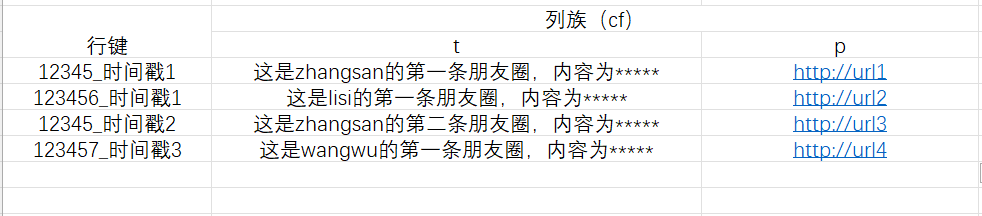
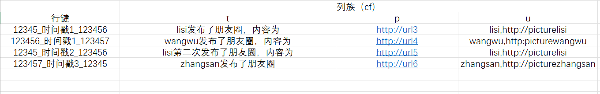

> `Hbase`在设计表的时候应考虑如何设计行键以提高查询效率

# 案例要求：

> 共有三个人，他们的姓名ID为：
>
> - zhangsan  ID:12345
> - lisi  ID:123456
> - wangwu   ID:123457
>
> 要求三个人互相关注

# 需求定义：

> 朋友圈的核心是每个用户各自拥有一个自己发布的相册和一个用户关注的好友动态，称之为时间线`TimeLine`。为了实现这两个功能，存储系统的设计需要考虑如下需求：
>
> - 需要知道哪些用户关注了`lisi`，以使这些用户能看到`lisi`的朋友圈
> - 需要知道`lisi`关注了哪些用户以计算这些用户能看到`zhangsan`朋友圈的评论
> - 为了保证体验，`lisi`的朋友圈打开速度要很快

# 问题建模：

## 查询哪些用户关注了`lisi`

关注`lisi`的人都能看到`lisi`的朋友圈

使用用户`ID`作为行键，被关注人的姓名作为列族

> t_user

## 查询`lisi`关注了哪些用户

### 使用宽表设计

使用用户`ID`作为行键，每列存储一个该用户关注人的`ID`

> t_following

### 使用高表设计

> 用户`ID`+被关注人用户`ID`作为行键，被关注人姓名作为列族
>
> t_following

### 关系+类型方法设计

> 用户`ID1`+关系0或1+用户`ID`2作为行键，用户`ID`2作为列族
>
> 0表示关注，1表示被关注 
>
> t_following

## 用户朋友圈相册表

用户发布朋友圈只需要插入一条数据到用户相册表

行键：用户`ID`+时间戳

列族`cf`包括两列：

- 列`t`：存储用户朋友圈的文字内容
- 列`p`：存储用户朋友圈图片的`CDN`缓存地址

> t_album

## 用户时间线表

行键：用户`ID`+时间戳+发布者`ID`

列族`cf`包含三列：

- 列`t`：存储用户朋友圈的文字内容
- 列`p`：存储用户朋友圈图片的`CDN`缓存地址
- 列`u`：用来存储发布者的个人基本信息（包括昵称和头像）

> t_timeline

