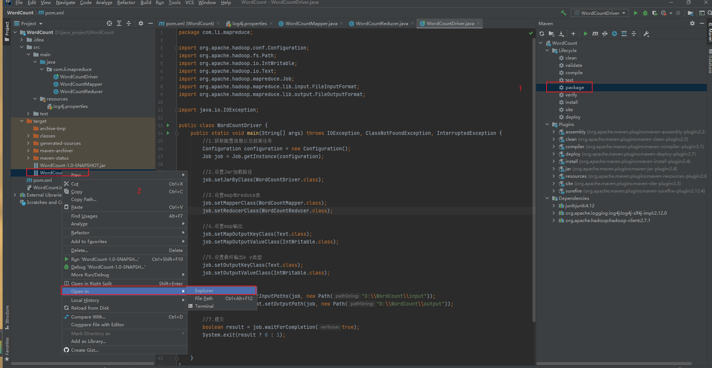

# `MapReduce`编写词频统计代码，并打`Jar`包上传到服务器

## 1.编写代码

### （1）添加依赖

```xml
<dependencies>
    <dependency>
        <groupId>junit</groupId>
        <artifactId>junit</artifactId>
        <version>4.12</version>
    </dependency>
    <dependency>
        <groupId>org.apache.logging.log4j</groupId>
        <artifactId>log4j-slf4j-impl</artifactId>
        <version>2.12.0</version>
    </dependency>
        <!-- https://mvnrepository.com/artifact/org.apache.hadoop/hadoop-client -->
        <dependency>
            <groupId>org.apache.hadoop</groupId>
            <artifactId>hadoop-client</artifactId>
            <version>2.7.1</version>
        </dependency>
    </dependencies>
```

### （2）日志文件

在`src/main/resources`下编写文件`log4j.properties`，并添加如下内容

```properties
log4j.rootLogger=INFO, stdout
log4j.appender.stdout=org.apache.log4j.ConsoleAppender
log4j.appender.stdout.layout=org.apache.log4j.PatternLayout
log4j.appender.stdout.layout.ConversionPattern=%d %p [%c] - %m%n
log4j.appender.logfile=org.apache.log4j.FileAppender
log4j.appender.logfile.File=target/spring.log
log4j.appender.logfile.layout=org.apache.log4j.PatternLayout
log4j.appender.logfile.layout.ConversionPattern=%d %p [%c] - %m%n
```

### （3）`Map`类

```java
package com.li.mapreduce;

import org.apache.hadoop.io.IntWritable;
import org.apache.hadoop.io.LongWritable;
import org.apache.hadoop.io.Text;
import org.apache.hadoop.mapreduce.Mapper;

import java.io.IOException;

public class WordCountMapper extends Mapper<LongWritable, Text, Text, IntWritable> {
    Text k = new Text();
    IntWritable v = new IntWritable(1);

    @Override
    protected void map(LongWritable key, Text value, Context context) throws IOException, InterruptedException {
        //1.获取一行
        String line = value.toString();

        //2.切割
        String[] words = line.split(" ");

        //3.输出
        for (String word: words){
            k.set(word);
            context.write(k, v);
        }
    }
}
```

### （4）`Reduce`类

```java
package com.li.mapreduce;

import org.apache.hadoop.io.IntWritable;
import org.apache.hadoop.io.Text;
import org.apache.hadoop.mapreduce.Reducer;

import java.io.IOException;

public class WordCountReducer extends Reducer<Text, IntWritable, Text, IntWritable> {
    int sum;
    IntWritable v = new IntWritable();
    @Override
    protected void reduce(Text key, Iterable<IntWritable> values, Context context) throws IOException, InterruptedException {
        //1.累加求和
        sum = 0;
        for (IntWritable count : values){
            sum += count.get();
        }

        //2.输出
        v.set(sum);
        context.write(key, v);
    }
}
```

### （5）`Driver`类

```java
package com.li.mapreduce;

import org.apache.hadoop.conf.Configuration;
import org.apache.hadoop.fs.Path;
import org.apache.hadoop.io.IntWritable;
import org.apache.hadoop.io.Text;
import org.apache.hadoop.mapreduce.Job;
import org.apache.hadoop.mapreduce.lib.input.FileInputFormat;
import org.apache.hadoop.mapreduce.lib.output.FileOutputFormat;

import java.io.IOException;

public class WordCountDriver {
    public static void main(String[] args) throws IOException, ClassNotFoundException, InterruptedException {
        //1.获取配置信息以及封装任务
        Configuration configuration = new Configuration();
        Job job = Job.getInstance(configuration);

        //2.设置Jar加载路径
        job.setJarByClass(WordCountDriver.class);

        //3.设置map和reduce类
        job.setMapperClass(WordCountMapper.class);
        job.setReducerClass(WordCountReducer.class);

        //4.设置map输出
        job.setMapOutputKeyClass(Text.class);
        job.setMapOutputValueClass(IntWritable.class);

        //5.设置最终输出k v类型
        job.setOutputKeyClass(Text.class);
        job.setOutputValueClass(IntWritable.class);

        //6.设置输入和输出路径
        FileInputFormat.setInputPaths(job, new Path("D:\\WordCount\\input"));
        FileOutputFormat.setOutputPath(job, new Path("D:\\WordCount\\output"));

        //7.提交
        boolean result = job.waitForCompletion(true);
        System.exit(result ? 0 : 1);


    }
}
```

> 注意设置的输入文件在文件夹`input`中
>
> 输出文件为`output`中的`part-r-00000`，且每次执行完，再次执行时需将`output`文件夹删除

## 2.本地测试

（1）需要首先配置好 `HADOOP_HOME`变量以及` Windows`运行依赖

（2）`在 IDEA`上运行`程序

## 3.打`Jar`包，上传服务器进行测试

（1)在`pom.xml`文件中添加打包插件依赖

```xml
<build>
        <plugins>
            <plugin>
                <artifactId>maven-compiler-plugin</artifactId>
<!--                <version>3.8.1</version>-->
                <configuration>
                    <source>1.8</source>
                    <target>1.8</target>
                </configuration>
            </plugin>

            <plugin>
                <artifactId>maven-assembly-plugin</artifactId>
                <configuration>
                    <descriptorRefs>
                        <descriptorRef>jar-with-dependencies</descriptorRef>
                    </descriptorRefs>
                </configuration>
                <executions>
                    <execution>
                        <id>make-assembly</id>
                        <phase>package</phase>
                        <goals>
                            <goal>single</goal>
                        </goals>
                    </execution>
                </executions>
            </plugin>
        </plugins>
    </build>
```

（2）打`Jar`包



（3）将`Jar`包拷贝到`Hadoop`集群的`/usr/local/hadoop`路径下

（4）启动`Hadoop`集群

（5）执行`WordCount`程序

```shell
 hadoop jar WordCount-1.0-SNAPSHOT.jar com/li/mapreduce/WordCountDriver /input /output
```

