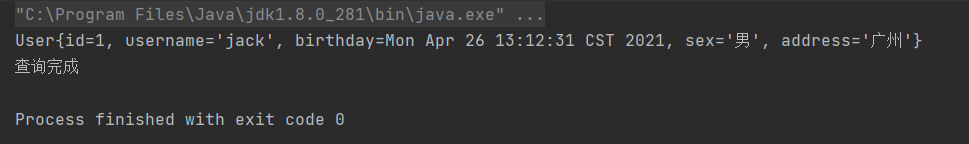
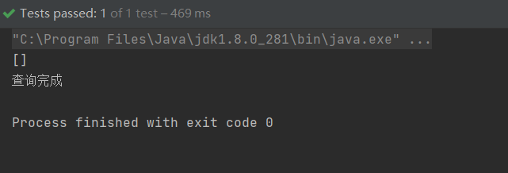

# Mybatis高级查询

> `Mybatis`简单查询可参考`https://ishuhui.gitee.io/2021042034221/`

## 1.`resultType`和`ResultMap`的区别

> `resultType`：
>
> 如果实体的属性名与表中字段名一致，将查询结果自动封装到实体类中
>
> `ResultMap`：
>
> 如果实体的属性名与表中字段名不一致，可以使用`ResultMap`实现手动封装到实体类中

### 1.`resultType`

编写`UserMapper`接口

```java
package com.luoshi.demo.dao;

import com.luoshi.demo.entity.User;

import java.util.List;

public interface UserMapper {
    //查询所有
    List<User> findAll();
}
```

编写`UserMapper.xml`文件

```xml
<?xml version="1.0" encoding="UTF-8" ?>
<!DOCTYPE mapper
        PUBLIC "-//mybatis.org//DTD Mapper 3.0//EN"
        "http://mybatis.org/dtd/mybatis-3-mapper.dtd">

<mapper namespace="com.luoshi.demo.dao.UserMapper">
    <select id="findAll" resultType="com.luoshi.demo.entity.User">
        select * from user
    </select>
</mapper>
```

编写测试代码

```java
import com.luoshi.demo.dao.UserMapper;
import com.luoshi.demo.entity.User;
import org.apache.ibatis.io.Resources;
import org.apache.ibatis.session.SqlSession;
import org.apache.ibatis.session.SqlSessionFactory;
import org.apache.ibatis.session.SqlSessionFactoryBuilder;
import org.junit.Test;

import javax.imageio.IIOException;
import java.io.IOException;
import java.io.InputStream;
import java.util.Date;
import java.util.List;

public class mybatisTest {
    @Test
    public void test(){

        try {
            //加载核心配置文件
            InputStream is = Resources.getResourceAsStream("SqlMapConfig.xml");

            //获取SqlSessionFactory工厂对象
            SqlSessionFactory sqlSessionFactory = new SqlSessionFactoryBuilder().build(is);

            //获取SqlSession会话对象
            SqlSession sqlSession = sqlSessionFactory.openSession();

            //获取映射
            UserMapper mapper = sqlSession.getMapper(UserMapper.class);

            //执行sql
            List<User> all=mapper.findAll();
            for(User user:all){
                System.out.println(user);
            }

            //释放资源
            sqlSession.close();

        }catch (IOException e){
            e.printStackTrace();
        }
    }
```

### 2.`ResultMap`

> 数据库中表的字段名为`id`和`username`
>
> 实体的属性名为`userid`和`name`

编写`UserMapper`接口

```java
package com.luoshi.test2.dao;

import com.luoshi.test2.entity.User;

import java.util.List;

public interface UserMapper {
    List<User> findAllResultMap();
}
```

编写`UserMapper.xml`文件

```xml
<?xml version="1.0" encoding="UTF-8" ?>
<!DOCTYPE mapper
        PUBLIC "-//mybatis.org//DTD Mapper 3.0//EN"
        "http://mybatis.org/dtd/mybatis-3-mapper.dtd">

<mapper namespace="com.luoshi.test2.dao.UserMapper">
    <resultMap id="userResultMap" type="com.luoshi.test2.entity.User">
        
        <!--表中主键字段封装，column对应表中的字段名，property对应实体的属性名-->
        <id column="id" property="userid"></id>
        
        <!--表中普通字段封装-->
        <result column="username" property="name"></result>
    </resultMap>

    <select id="findAllResultMap" resultMap="userResultMap">
           select * from user
    </select>
</mapper>
```

编写测试代码

```java
import com.luoshi.test2.dao.UserMapper;
import com.luoshi.test2.entity.User;
import org.apache.ibatis.io.Resources;
import org.apache.ibatis.session.SqlSession;
import org.apache.ibatis.session.SqlSessionFactory;
import org.apache.ibatis.session.SqlSessionFactoryBuilder;
import org.junit.Test;

import java.io.IOException;
import java.io.InputStream;
import java.util.List;

public class mybatisTest {
    @Test
    public void test() {
        try {
            //加载核心配置文件
            InputStream is = Resources.getResourceAsStream("SqlMapConfig.xml");

            //获取SqlSessionFactory工厂对象
            SqlSessionFactory sqlSessionFactory = new SqlSessionFactoryBuilder().build(is);

            //获取SqlSession会话对象
            SqlSession sqlSession = sqlSessionFactory.openSession();

            //获取映射
            UserMapper userMapper = sqlSession.getMapper(UserMapper.class);

            //执行sql
            List<User> list = userMapper.findAllResultMap();
            for (User user : list) {
                System.out.println(user);
            }
            System.out.println("查询完成");
            
            //释放资源
            sqlSession.close();
        } catch (IOException e) {
            e.printStackTrace();
        }
    }
}
```

## 2.多条件查询

`User.java`文件

```java
package com.luoshi.test2.entity;

import java.util.Date;

public class User {
    private int id;
    private String username;
    private Date birthday;
    private String sex;
    private String address;

    @Override
    public String toString() {
        return "User{" +
                "id=" + id +
                ", username='" + username + '\'' +
                ", birthday=" + birthday +
                ", sex='" + sex + '\'' +
                ", address='" + address + '\'' +
                '}';
    }

    public int getId() {
        return id;
    }

    public void setId(int id) {
        this.id = id;
    }

    public String getUsername() {
        return username;
    }

    public void setUsername(String username) {
        this.username = username;
    }

    public Date getBirthday() {
        return birthday;
    }

    public void setBirthday(Date birthday) {
        this.birthday = birthday;
    }

    public String getSex() {
        return sex;
    }

    public void setSex(String sex) {
        this.sex = sex;
    }

    public String getAddress() {
        return address;
    }

    public void setAddress(String address) {
        this.address = address;
    }
}
```

`SqlMapConfig.xml`文件

```xml
<?xml version="1.0" encoding="UTF-8" ?>
<!DOCTYPE configuration
        PUBLIC "-//mybatis.org//DTD Config 3.0//EN"
        "http://mybatis.org/dtd/mybatis-3-config.dtd">

<configuration>
    <environments default="mysql">
        <environment id="mysql">
            <transactionManager type="JDBC"></transactionManager>
            <dataSource type="POOLED">
                <property name="driver" value="com.mysql.jdbc.Driver"/>
                <property name="url" value="jdbc:mysql://localhost:3306/hui"/>
                <property name="username" value="root"/>
                <property name="password" value="123456"/>
            </dataSource>
        </environment>
    </environments>

    <mappers>
        <mapper resource="UserMapper.xml"/>
    </mappers>
</configuration>
```

### 方法一：

使用`#{arg0}-#{argn}`或者`#{param1}-#{paramn}`获取参数

编写`UserMapper`接口

```java
package com.luoshi.test2.dao;

import com.luoshi.test2.entity.User;

import java.util.List;

public interface UserMapper {
    public List<User> findByIdUsername1(Integer id, String username);
}
```

编写`UserMapper.xml`文件

```xml
<?xml version="1.0" encoding="UTF-8" ?>
<!DOCTYPE mapper
        PUBLIC "-//mybatis.org//DTD Mapper 3.0//EN"
        "http://mybatis.org/dtd/mybatis-3-mapper.dtd">

<mapper namespace="com.luoshi.test2.dao.UserMapper">
    <select id="findByIdUsername1" resultType="com.luoshi.test2.entity.User">
           select * from user where id = #{param1} and username = #{param2}
    </select>
</mapper>
```

编写测试代码

```java
import com.luoshi.test2.dao.UserMapper;
import com.luoshi.test2.entity.User;
import org.apache.ibatis.io.Resources;
import org.apache.ibatis.session.SqlSession;
import org.apache.ibatis.session.SqlSessionFactory;
import org.apache.ibatis.session.SqlSessionFactoryBuilder;
import org.junit.Test;

import java.io.IOException;
import java.io.InputStream;
import java.util.List;

public class mybatisTest {
    @Test
    public void test() {
        try {
            //加载核心配置文件
            InputStream is = Resources.getResourceAsStream("SqlMapConfig.xml");

            //获取SqlSessionFactory工厂对象
            SqlSessionFactory sqlSessionFactory = new SqlSessionFactoryBuilder().build(is);

            //获取SqlSession会话对象
            SqlSession sqlSession = sqlSessionFactory.openSession();

            //获取映射
            UserMapper userMapper = sqlSession.getMapper(UserMapper.class);

            //执行sql
            List<User> list = userMapper.findByIdUsername1(1, "jack");
            for (User user : list) {
                System.out.println(user);
            }
            System.out.println("查询完成");
            //释放资源
            sqlSession.close();
        } catch (IOException e) {
            e.printStackTrace();
        }
    }
}
```



### 方法二：

使用注解，引入`@Param()`注解获取参数

编写`UserMapper`接口

```java
public interface UserMapper {
    public List<User> findByIdAndUsername2(@Param("id") Integer id,@Param("username") String username);
}
```

编写`UserMapper.xml`文件

```xml
<mapper namespace="com.luoshi.test2.dao.UserMapper">
    <select id="findByIdAndUsername2" resultType="com.luoshi.test2.entity.User">
           select * from user where id = #{id} and username = #{username}
    </select>
</mapper>
```

编写测试代码

```java
 @Test
    public void test() {
        try {
            //加载核心配置文件
            InputStream is = Resources.getResourceAsStream("SqlMapConfig.xml");

            //获取SqlSessionFactory工厂对象
            SqlSessionFactory sqlSessionFactory = new SqlSessionFactoryBuilder().build(is);

            //获取SqlSession会话对象
            SqlSession sqlSession = sqlSessionFactory.openSession();

            //获取映射
            UserMapper userMapper = sqlSession.getMapper(UserMapper.class);

            //执行sql
            List<User> list = userMapper.findByIdAndUsername2(1, "jack");
            for (User user : list) {
                System.out.println(user);
            }
            System.out.println("查询完成");
            //释放资源
            sqlSession.close();
        } catch (IOException e) {
            e.printStackTrace();
        }
    }
```


### 方法三（推荐）：

使用`pojo`对象传递参数

编写`UserMapper`接口

```java
public interface UserMapper {
    public List<User> findByIdAndUsername3(User user);
}
```

编写`UserMapper.xml`文件

```xml
<mapper namespace="com.luoshi.test2.dao.UserMapper">
    <select id="findByIdAndUsername3" parameterType="com.luoshi.test2.entity.User" resultType="com.luoshi.test2.entity.User">
           select * from user where id = #{id} and username = #{username}
    </select>
</mapper>
```

编写测试代码

```java
  @Test
    public void test() {
        try {
            //加载核心配置文件
            InputStream is = Resources.getResourceAsStream("SqlMapConfig.xml");

            //获取SqlSessionFactory工厂对象
            SqlSessionFactory sqlSessionFactory = new SqlSessionFactoryBuilder().build(is);

            //获取SqlSession会话对象
            SqlSession sqlSession = sqlSessionFactory.openSession();

            //获取映射
            UserMapper userMapper = sqlSession.getMapper(UserMapper.class);
            User param = new User();
            param.setId(1);
            param.getUsername("jack");

            //执行sql
            List<User> list = userMapper.findByIdAndUsername3(param);
            System.out.println(list);
            System.out.println("查询完成");
            //释放资源
            sqlSession.close();
        } catch (IOException e) {
            e.printStackTrace();
        }
    }
```



## 3.模糊查询

> 需求：根据`username`模糊查询`user`表

### 方法一（推荐）：

编写`UserMapper`接口

```java
public interface UserMapper {
    public List<User> findByUsername1(String username);
}
```

编写`UserMapper.xml`文件

```xml
<mapper namespace="com.luoshi.test2.dao.UserMapper">
    <select id="findByUsername1" parameterType="String" resultType="com.luoshi.test2.entity.User">
           select * from user where username like #{username}
    </select>
</mapper>
```

编写测试代码

```java
@Test
    public void test() {
        try {
            //加载核心配置文件
            InputStream is = Resources.getResourceAsStream("SqlMapConfig.xml");

            //获取SqlSessionFactory工厂对象
            SqlSessionFactory sqlSessionFactory = new SqlSessionFactoryBuilder().build(is);

            //获取SqlSession会话对象
            SqlSession sqlSession = sqlSessionFactory.openSession();

            //获取映射
            UserMapper userMapper = sqlSession.getMapper(UserMapper.class);

            //执行sql
            List<User> list = userMapper.findByUsername1("%小%");
            for (User user : list) {
                System.out.println(user);
            }
            System.out.println("查询完成");
            //释放资源
            sqlSession.close();
        } catch (IOException e) {
            e.printStackTrace();
        }
    }
```

### 方法二：

编写`UserMapper`接口

```java
public interface UserMapper {
    public List<User> findByUsername2(String username);
}
```

编写`UserMapper.xml`文件

```xml
<mapper namespace="com.luoshi.test2.dao.UserMapper">

    <!--不推荐使用，因为会出现sql注入的问题-->
    <select id="findByUsername2" parameterType="String" resultType="com.luoshi.test2.entity.User">
           select * from user where username like '${value}'
    </select>
</mapper>
```

编写测试代码

```java
   @Test
    public void test() {
        try {
            //加载核心配置文件
            InputStream is = Resources.getResourceAsStream("SqlMapConfig.xml");

            //获取SqlSessionFactory工厂对象
            SqlSessionFactory sqlSessionFactory = new SqlSessionFactoryBuilder().build(is);

            //获取SqlSession会话对象
            SqlSession sqlSession = sqlSessionFactory.openSession();

            //获取映射
            UserMapper userMapper = sqlSession.getMapper(UserMapper.class);

            //执行sql
            List<User> list = userMapper.findByUsername2("%小%");
            for (User user : list) {
                System.out.println(user);
            }
            System.out.println("查询完成");
            //释放资源
            sqlSession.close();
        } catch (IOException e) {
            e.printStackTrace();
        }
    }
```

> ### `#{}`与`${}`的区别
>
> `#{}`表示一个占位符号：
>
> - 通过`#{}`可以实现`preparedStatement`向占位符中设置值，自动进行`java`类型和`jdbc`类型转换，`#{}`可以 有效防止`sql`注入
>
> - `#{}`可以接收简单类型值或`pojo`属性值
>
> - 如果`parameterType`传输单个简单类型值，`#{}`括号中名称随便写
>
>   
>
> `${}`表示拼接`sql`串：
>
> - 通过`${}`可以将`parameterType`传入的内容拼接在`sql`中且不进行`jdbc`类型转换，会出现`sql`注入问题
> - `${}`可以接收简单类型值或`pojo`属性值
> - 如果`parameterType`传输单个简单类型值，`${}`括号中只能是`value`