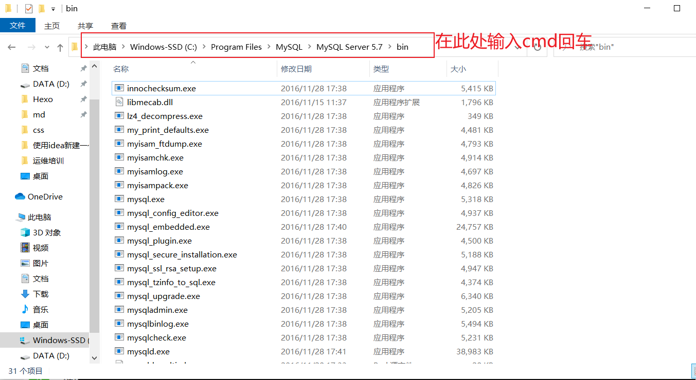
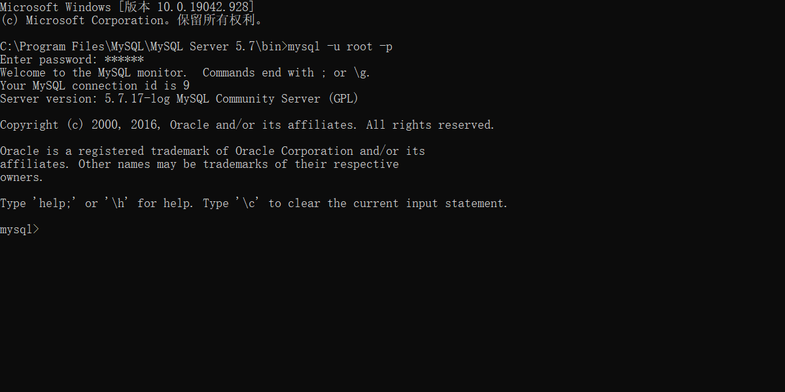

# MySQL数据库的基本操作

> SQL不区分关键字的大小写，但是一般关键字大写，表的首字母大写，其余（列名）小写
>
> 数据库的名称只能使用小写字母

## 1.启动MySQL数据库

在命令行中输入下列命令查看MySQL服务是否启动，并且可以看到所安装的数据库的版本

```bash
C:\WINDOWS\system32>services.msc
```

启动和关闭数据库时，使用管理员权限打开命令行

```bash
#开启数据库
net start mysql57

#关闭数据库
net stop mysql57
```

## 2.在命令行中进行数据库操作

找到MySQL的安装路径，进入`bin`路径下




输入命令`mysql -u root -p`，并且输入密码，进入数据库



## 3.通过可视化连接工具进行数据库操作

下载并激活`Navicat`

点击连接，选择`MySQL`


## 4.常用SQL语句

1.创建数据库

```sql
CREATE DATABASE <数据库名>;
```

数据库名只能用小写字母

2.删除数据库

```sql
DROP DATABASE <数据库名>;
```

3.查看数据库

```sql
SHOW DATABASES;
```

4.使用这个数据库

```sql
USE <数据库名>;
```

5.查看表

```sql
SHOW TABLES;
```

6.创建表

```sql
CREATE TABLE `user` (
	`id` INT ( 11 ) NOT NULL auto_increment,
	`username` VARCHAR ( 32 ) NOT NULL COMMENT '用户名称',
	`birthday` datetime DEFAULT NULL COMMENT '生日',
	`sex` CHAR ( 1 ) DEFAULT NULL COMMENT '性别',
	`address` VARCHAR ( 256 ) DEFAULT NULL COMMENT '地址',
PRIMARY KEY ( `id` ) 
) ENGINE = INNODB DEFAULT CHARSET = utf8;
```

7.在表中插入数据

```mysql
#插入指定列的数据
INSERT INTO USER ( `id`, `username` )
VALUES
	(5,'李四')
	
#全部插入
INSERT INTO `user` ( `id`, `username`, `birthday`, `sex`, `address` )
VALUES
	(1, '小明', '2020-11-11 00:00:00', '男', '北京' ),
	(2,'李华','2020-12-12 00:00:00','男','上海')
```

8.数据查询

```mysql
#查询user表中的所有数据
SELECT * FROM user;

#查询固定id的数据
SELECT * FROM user WHERE id = 2;

#多条查询
SELECT * FROM user WHERE id in (2,3);

#查询记录总数
SELECT COUNT(*) FROM user;

#查询表的前n行数据
SELECT * FROM user LIMIT n;

```

9.数据删除

```mysql
#删除指定行数据
DELETE FROM user where username = '张三';
DELETE FROM user where id = 1;

#删除表中所有数据
DELETE FROM user;
```

