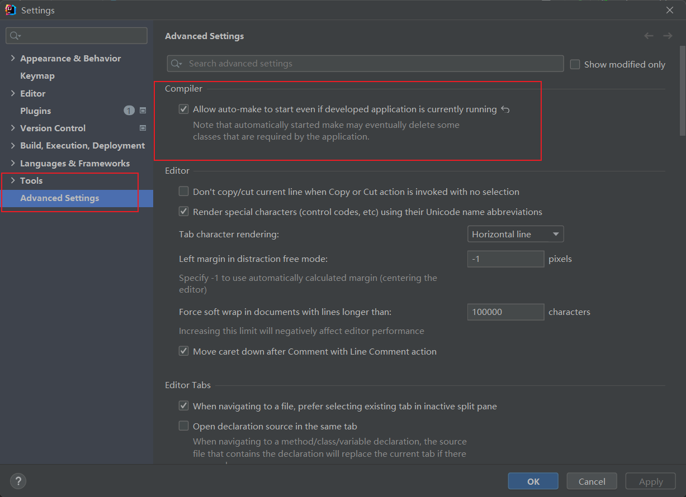
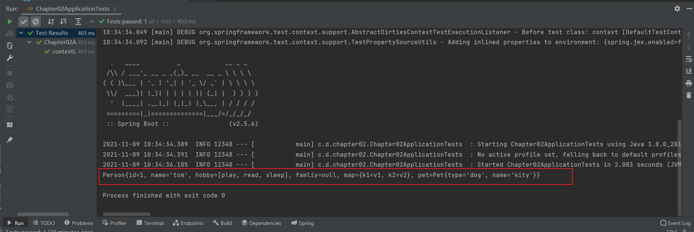
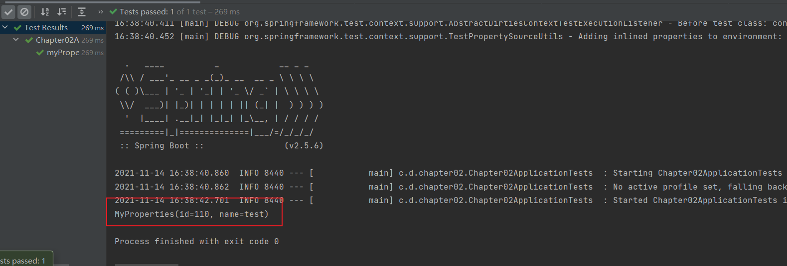
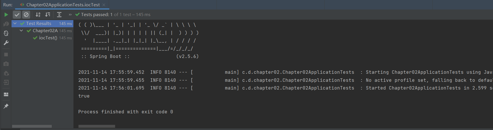
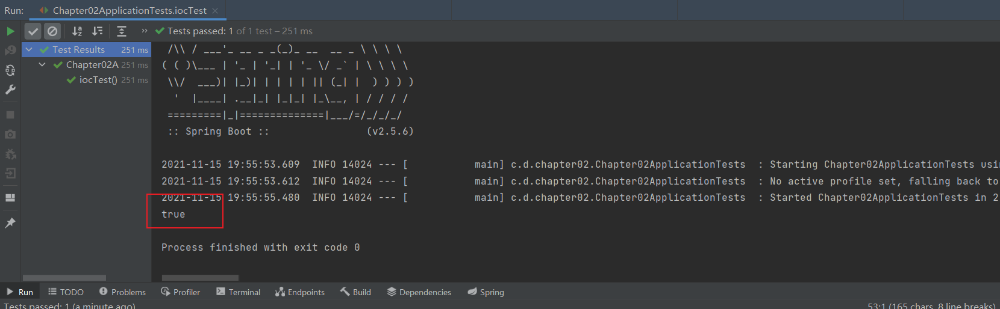
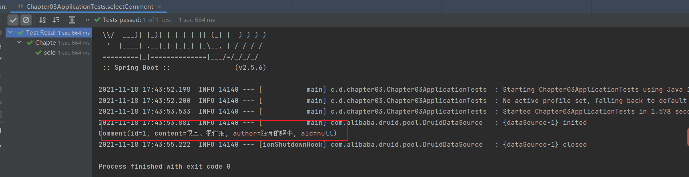

## 第一章

### 1.使用`Spring Initializr`方式构建的`Spring Boot`项目

使用`Spring Initializr`方式构建的`Spring Boot`项目会默认生成：

- 项目启动类
- 存放前端静态资源和页面的文件夹
- 编写项目配置的配置文件
- 运行项目单元测试的测试类

2.创建用于`web`访问的`Controller`

在`src/main/java/com/day/chapter01/`下创建名为`controller`的包，并在该包下创建名为`HelloController`的请求处理控制类

```java
package com.day.chapter01.controller;

import org.springframework.web.bind.annotation.GetMapping;
import org.springframework.web.bind.annotation.RestController;

@RestController  //将当前类作为控制层的组件添加到spring容器中，同时该类的方法无法返回JSP页面，而会返回JSON字符串
public class HelloController {
    @GetMapping("/hello")   //设置方法的访问路径，并限定访问方式为get
    public String hello() {   //该方法的请求处理路径为“/hello”
        return "hello spring boot";
    }
}
```

3.运行项目

启动成功后会在控制台发现`spring boot`项目默认的端口号为8080

在浏览器上访问`http://localhost:8080/hello`，查看页面内容

### 2.单元测试

> 单元测试的作用：每当完成一个功能或业务方法的编写后，通常都会借助单元测试验证该功能是否正确
>
> 注：使用用`Spring Initializr`方式构建的`Spring Boot`项目自动加入`spring-boot-starter-test`测试依赖启动器，且已自动生成单元测试类

1.添加`spring-boot-starter-test`测试依赖启动器

```xml
<dependency>
     <groupId>org.springframework.boot</groupId>
     <artifactId>spring-boot-starter-test</artifactId>
     <scope>test</scope>
</dependency>
```

2.编写单元测试类和测试方法

```java
package com.day.chapter01;

import com.day.chapter01.controller.HelloController;
import org.junit.jupiter.api.Test;
import org.junit.runner.RunWith;
import org.springframework.beans.factory.annotation.Autowired;
import org.springframework.boot.test.context.SpringBootTest;
import org.springframework.test.context.junit4.SpringRunner;

@RunWith(SpringRunner.class)  //测试运行器，加载spring boot测试注解
@SpringBootTest  //标记单元测试类，并加载项目的上下文环境ApplicationContext
class Chapter01ApplicationTests {
    //自动创建的单元测试方法
    @Test
    void contextLoads() {
    }

    @Autowired  //该注解注入了HelloController实例对象
    private HelloController helloController;

    @Test
    public void helloControllerTest() {
        String hello = helloController.hello();  //调用HelloController类中对应的请求控制方法hello()
        System.out.println(hello);  //输出hello的值
    }

}
```

3.运行`helloControllerTest()`方法

控制台将会打印出`hello spring boot`，说明控制类`HelloController`中的`hello()`方法被成功调用并执行

### 3.热部署

> 在开发过程中，通常会对一段业务代码不断地修改测试，在修改之后往往需要重启服务，有些服务需要加载很久才能启动成功，这种不必要的重复操作极大降低了程序开发效率。
>
> `Spring Boot`框架专门提供了进行热部署的依赖启动器，用于进行项目热部署，无需开发人员手动重启项目

1.添加`spring-boot-devtools`热部署依赖启动器

```xml
<!-- 引入热部署依赖-->
<dependency>
    <groupId>org.springframework.boot</groupId>
    <artifactId>spring-boot-devtools</artifactId>
</dependency>
```

2.`IDEA2021`工具热部署设置

[File]-->[Settings]-->[Build, Execution, Deployment]-->[Complier]


[File]-->[Settings]-->[Tools]-->[Advanced Settings]



3.重启`IDEA`，进行效果测试

启动项目，在不关闭当前项目的情况下，将请求处理方法`hello()`的返回值修改并保存，刷新浏览器，发现页面内容改变，查看控制台信息发现项目能够自动构建和编译，说明项目热部署生效

### 4. `Spring Boot`依赖管理

1.`spring-boot-starter-parent`依赖

```xml
<!--    Spring Boot 父项目依赖管理-->
<parent>
     <groupId>org.springframework.boot</groupId>
     <artifactId>spring-boot-starter-parent</artifactId>
     <version>2.5.6</version>
     <relativePath/> <!-- lookup parent from repository -->
</parent>
```

> 通过该依赖，`pom.xml`引入依赖文件时，不需要使用`<version>`标签指定依赖文件的版本号

2.`spring-boot-starter-web`依赖

```xml
<dependency>
     <groupId>org.springframework.boot</groupId>
     <artifactId>spring-boot-starter-web</artifactId>
</dependency>
```

> 该依赖的主要作用是提供`Web`开发场景所需的底层所有依赖，它对`Web`开发场景所需的依赖文件进行了统一管理

### 5.`Spring Boot`自动配置

> `@SpringBootApplication`注解是一个组合注解，包含`@SpringBootConfiguration`、`@EnableAutoConfiguration`、`@ComponentScan`三个核心注解

1.`@SpringBootConfiguration`注解

> 标识一个可以被组件扫描器扫描的配置类

2.`@EnableAutoConfiguration`

> 表示开启自动配置功能，是实现自动化配置的注解。包含`@AutoConfigurationPackage`和`@import`两个核心注解。
>
> `@AutoConfigurationPackage`注解的主要作用是获取项目主程序启动类所在的根目录，从而指定后续组件扫描器要扫描包的位置。因此在定义项目包结构时，要求定义的包结构非常规范，项目主程序启动类要定义在最外层的根目录位置，然后在根目录位置内部建立子包和类进行业务开发，这样能够保证定义的类能够被组件扫描器扫描

3.`@ComponentScan`

> 组件包扫描器，用于将指定包中的注解类自动装配到`Spring`的`Bean`容器中

## 第二章

### 1.全局配置文件

#### 1.`application.properties`配置文件

> 可以在`application.properties`文件中定义`Spring Boot`项目的相关属性，如：系统属性、环境变量、命令参数等信息，也可以是自定义配置文名称和位置

(1)在项目的`com.day.chapter02`包下创建一个`domain`包，并在该包下创建两个实体类`Pet`和`Person`

```java
package com.day.chapter02.domain;

import lombok.Data;

@Data
public class Pet {
    private String type;
    private String name;
}
```

```java
package com.day.chapter02.domain;

import lombok.Data;
import org.springframework.boot.context.properties.ConfigurationProperties;
import org.springframework.stereotype.Component;

import java.util.Arrays;
import java.util.List;
import java.util.Map;

@Data
@Component    //用于将Person类作为Bean注入容器中
@ConfigurationProperties(prefix = "person")  //将配置文件中以person开头的属性值通过setter()方法注入该实体类对应的属性中
public class Person {
    private int id;
    private String name;
    private List hobby;
    private String[] family;
    private Map map;
    private Pet pet;
}
```

(2)在`resources`目录下的`application.propertites`配置文件中编写需要对`Person`类设置的配置属性

```properties
# 对实体类对象Person进行属性配置person.id=1person.name=tomperson.hobby=play,read,sleepperson.family=father,motherperson.map.k1=v1person.map.k2=v2person.pet.type=dogperson.pet.name=kity
```

> `Spring Boot`默认全局配置文件`application.properties`中通过`person.****`对`Person`的相关属性进行配置，这些属性会通过`@ConfigurationProperties(prefix = "person")`注解注入`Person`实体类的相关属性中

(3)添加配置处理器依赖

```xml
<dependency>     <groupId>org.springframework.boot</groupId>     <artifactId>spring-boot-configuration-processor</artifactId>     <version>2.1.3.RELEASE</version></dependency>
```

(4)编写测试文件

> 单元测试，查看`application.properties`文件是否是否正确，同时查看属性配置效果

```java
package com.day.chapter02;import com.day.chapter02.domain.Person;import org.junit.jupiter.api.Test;import org.junit.runner.RunWith;import org.springframework.beans.factory.annotation.Autowired;import org.springframework.boot.test.context.SpringBootTest;import org.springframework.test.context.junit4.SpringRunner;@RunWith(SpringRunner.class)  //测试运行器，加载spring boot测试注解@SpringBootTest   //标记单元测试类，并加载项目的上下文环境ApplicationContextclass Chapter02ApplicationTests {    @Autowired   //将Person作为Bean注入Spring容器    private Person person;    @Test    public void contextLoads() {        System.out.println(person);    }}
```

(5)运行测试类，在控制台查看结果



#### 2.`application.yaml`配置文件

(1)在`resources`目录下新建一个`application.yaml`配置文件，在该配置文件中设置`Person`对象的属性值

```yaml
# 对实体类对象Person进行属性配置person:  id: 2  name: 张三  hobby: [read, sing, sleep]  family: [father, mather]  map: {k1: v1, k2: v2}  pet: {type: cat, name: tom}
```

(2)运行测试类

运行之前需要将之前的`application.properties`配置文件中编写过的配置进行注释，因为`application.properties`配置文件的优先级要高于`application.yalm`配置文件


> 备注：`YAML`配置文件的格式更加简明、方便，推荐使用

### 2.配置文件属性值的注入

> 如果配置的属性是`Spring Boot`默认提供的属性，例如服务器端口`server.port`，那么`Spring Boot`内部会自动扫描并读取属性值。
>
> 如果配置的属性是用户自定义的属性，如`Person`的实体类属性，则必须在程序中注入这些配置属性方可生效

#### 1.使用`@ConfigurationProperties`注入配置文件属性

#### 2.使用`@Value`注入属性

(1)在`domain`包下创建一个实体类`Student`，并使用`@Value`注解注入属性`id`和`name`

```java
package com.day.chapter02.domain;import org.springframework.beans.factory.annotation.Value;import org.springframework.stereotype.Component;import java.util.Arrays;import java.util.List;import java.util.Map;@Component  //用于将Student类作为Bean注入Spring容器中public class Student {    @Value("${person.id}")    private int id;    @Value("${person.name}")    private String name;    private List hobby;    private String[] family;    private Map map;    private Pet pet;    @Override    public String toString() {        return "Student{" +                "id=" + id +                ", name='" + name + '\'' +                ", hobby=" + hobby +                ", family=" + Arrays.toString(family) +                ", map=" + map +                ", pet=" + pet +                '}';    }}
```

(2)编写测试方法

```java
//测试@Value属性注入@Autowired  //引入Spring容器中的Student实体类Bean    private Student student;    @Test    public void studentTest(){        System.out.println(student);    }
```

(3)运行测试方法，在控制台可以看到`Student`对象的`id`和`name`属性值


两种注解的对比：


> 区别：
>
> `@Value`不仅支持注入`Person`的`id`属性，而且还可以直接为`id`属性赋值，只是`@ConfigurationProperties`不支持的

### 3.`Spring Boot`自定义配置

> 自定义配置文件`Spring Boot`是无法识别的，需要手动加载

#### 1.使用`@PropertySource`加载配置文件

(1)在`resources`目录下编写`test.properties`自定义配置文件

```properties
test.id=110test.name=test
```

(2)在`domain`包下自定义一个配置类`MyProperties`

```java
package com.day.chapter02.domain;import lombok.Data;import org.springframework.boot.context.properties.ConfigurationProperties;import org.springframework.boot.context.properties.EnableConfigurationProperties;import org.springframework.context.annotation.Configuration;import org.springframework.context.annotation.PropertySource;@Configuration //表示当前类是自定义配置类，该类会作为Bean组件添加到Spring容器中，这里等同于@Configuration注解@PropertySource("classpath:test.properties")  //指定了自定义配置文件的位置和名称@EnableConfigurationProperties(MyProperties.class) //开启对应配置类MyProperties的属性注入功能，该注解配合@ConfiguratiojnProperties使用@ConfigurationProperties(prefix = "test")@Data  //提供getter和setter方法public class MyProperties {    private int id;    private String name;}
```

(3)编写自定义配置文件的测试方法

```java
//测试自定义配置文件，@PropertySource和@Configuration    @Autowired //将MyProperties类型的对象自动装载为Bean    private MyProperties myProperties;    @Test    public void myPropertyTest(){        System.out.println(myProperties);    }
```

(4)运行测试类，查看控制台内容



#### 2.使用`@ImportResource`加载`XML`配置文件

> 可以使用`@ImportResource`注解，将外部的`XML`文件加载到程序中
>
> `@ImportResource`注解标注在一个配置类上，通常放置在应用启动类上，使用时需要指定`XML`配置文件的路径和名称

(1)在`com.day.chapter02`下创建`config`包，并在该包下创建`MyService`类，该类中不需要编写任何代码

由于这是一个空的类，且该类中没有添加任何配置和注解，因此还无法正常被Spring Boot扫描和识别

(2)在`resouces`下创建一个名为`beans.xml`的`XML`自定义配置文件，在该配置文件中将`MyService`配置为`Bean`

```xml
<?xml version="1.0" encoding="UTF-8"?><beans xmlns="http://www.springframework.org/schema/beans"       xmlns:xsi="http://www.w3.org/2001/XMLSchema-instance"       xsi:schemaLocation="http://www.springframework.org/schema/beans                      http://www.springframework.org/schema/beans/spring-beans.xsd"><!--    通过<Bean>标签将MyService标注为Spring容器中的Bean组件-->    <bean id="myService" class="com.day.chapter02.config.MyService" /></beans>
```

(3)为使`beans.xml`配置文件生效，需要在项目启动类`Chapter02Application.java`上添加`@ImportResoource`注解来指定`XML`文件位置

```java
package com.day.chapter02;import org.springframework.boot.SpringApplication;import org.springframework.boot.autoconfigure.SpringBootApplication;import org.springframework.context.annotation.ImportResource;@ImportResource("classpath:beans.xml")  //指定加载自定义xml配置文件的位置@SpringBootApplicationpublic class Chapter02Application {    public static void main(String[] args) {        SpringApplication.run(Chapter02Application.class, args);    }}
```

(4)编写测试方法

```java
//测试自定义配置文件，使用@ImpoerResource加载XML配置文件    @Autowired  //引入了Spring容器实例ApplicationContext    private ApplicationContext applicationContext;    @Test    public void iocTest() {        //在该测试方法中查看该容器中是否包含id为myService的组件        System.out.println(applicationContext.containsBean("myService"));    }
```



#### 3.使用`@Configuration`编写自定义配置类

> 在`Spring Boot`开发中，“约定大于配置”的思想，更推荐使用配置类的方式代替`XML`配置
>
> 使用`@Configuration`注解可以指定配置类，它的作用和xml配置是一样的，配置类中@Bean注解方法返回的对象都将作为Bean注入Spring容器，并且默认情况下，使用@Bean注解的方法名就是组件名

1.在`config`包下创建`MyService`类，使用`@Configuration`注解声明该类为一个配置类

```java
package com.day.chapter02.config;import org.springframework.context.annotation.Bean;import org.springframework.context.annotation.Configuration;@Configuration   //定义该类是一个配置类，该配置类会被Spring Boot自动扫描识别public class MyConfig {    @Bean //将返回值对象作为组件添加到Spring容器中，该组件id默认为方法名    public MyService myService() {        return new MyService();    }}
```

2.将项目启动类`Chapter02Application`上添加的`@ImportResource`注解注释

执行测试方法`iocTest()`



### 4.`Profile`多环境配置

> 在实际开发中，应用程序通常需要部署到不同的运行环境中去，如开发环境、测试环境、生产环境等。不同的环境可能需要不同的环境配置，手动修改配置文件适应不同开发环境不太现实，此时会对项目进行多环境配置

#### 1.使用`Profile`文件进行多环境配置

使用`Profile`文件进行多环境配置时，该配置文件名必须满足`application-{profile}.properties`的格式，其中`{profile}`是对应具体的环境标识

```properties
application-dev.properties     # 开发环境配置文件application-test.properties    # 测试环境配置文件application-prod.properties    # 生产环境配置文件
```

使用上述对应环境的配置文件，需要在`Spring Boot`全局配置文件中激活指定环境的配置文件

如：在控制台执行下列命令激活环境配置

```shel
java -jar xxx.jar --spring.profiles.active=dev
```

或者在项目全局配置文件中配置`spring.profiles.active`属性激活配置

如：在全局配置文件`application.properties`中配置激活环境的属性

```properties
# 激活开发环境配置文件spring.profiles.active=dev
```

(1)在`resources`目录下创建多环境配置文件，并添加不同的设置

- `application-dev.properties`

  ```properties
  server.port=8081
  ```

  

- `application-test.properties`

  ```properties
  server.port=8082
  ```

  

- `application-prod.properties`

  ```properties
  server.port=8083
  ```

(2)在`application.properties`全局配置文件中配置`spring.profiles.active`属性，选择性激活`Profile`文件设置

```properties
# 指定要激活的profile多环境配置文件spring.profiles.active=dev
```

(3)运行项目启动类`Chapter02Application`，在控制台查看配置是否生效


> 若报错，注意编码格式

#### 2.使用`@Profile`注解进行多环境配置

> 使用`@Profile`注解进行多环境配置，`@Profile`注解主要作用于类，并通过`value`属性指定配置环境（等同于`Profile`文件名称中的`profile`值）
>
> 同样需要在全局配置文件中激活

(1)在`config`包下创建一个用于配置数据库的借接口文件`DBConnector`

```java
package com.day.chapter02.config;public interface DBConnector {    public void configure();}
```

(2)在`config`包下创建三个实现`DBConnector`接口的类，并重写`configure()`方法，分别模拟连接配置不同的数据库环境

- `DevDBConnector`

  ```java
  package com.day.chapter02.config;import org.springframework.context.annotation.Configuration;import org.springframework.context.annotation.Profile;@Configuration   //定义该类是一个配置类，该配置类会被Spring Boot自动扫描@Profile("dev")  //指定多环境配置类标识public class DevDBConnector implements DBConnector{    @Override    public void configure() {        System.out.println("数据库配置环境dev");    }}
  ```

- `TestDBConnector`

  ```java
  package com.day.chapter02.config;import org.springframework.context.annotation.Configuration;import org.springframework.context.annotation.Profile;@Configuration   //定义该类是一个配置类，会被Spring Boot自动扫描@Profile("test")  //指定多环境配置类标识public class TestDBConnector implements DBConnector{    @Override    public void configure() {        System.out.println("数据库配置环境test");    }}
  ```

- `ProdDBConnector`

  ```java
  package com.day.chapter02.config;import org.springframework.context.annotation.Configuration;import org.springframework.context.annotation.Profile;@Configuration  //定义该类是一个自定义配置类，会被Spring Boot自动扫描识别@Profile("prod")   //指定多环境配置类标识public class ProdDBConnector  implements DBConnector{    @Override    public void configure() {        System.out.println("数据库配置环境prod");    }}
  ```

(3)在全局配置文件`application.properties`中设置`spring.profiles.active`属性激活使用`@Profile`注解构建的多环境配置

(4)测试`@Profile`注解多环境配置的效果

新建`controller`包，并在该包下创建一个表示数据库连接配置的`DBController`类进行测试

```java
package com.day.chapter02.controller;import com.day.chapter02.config.DBConnector;import org.springframework.beans.factory.annotation.Autowired;import org.springframework.web.bind.annotation.GetMapping;import org.springframework.web.bind.annotation.RestController;@RestControllerpublic class DBController {    @Autowired  //注入DBConnector    private DBConnector dbConnector;    @GetMapping("/showDB")  //该注解用于映射GET请求，此处用于映射路径为"/showDB"的请求    public void showDB() {        dbConnector.configure();    }}
```

(5)启动`Chapter02Application`启动类，访问`http://localhost:8081/showDB`，查看控制台输出效果


### 5.随机值设置以及参数引用

(1)在配置文件`application.properties`中通过随机值和参数引用的方式添加两个测试属性

```properties
# 随机值设置以及参数间引用配置tom.age=${random.int[10,20]}tom.description=Tom's age is ${tom.age}
```

(2)编写测试方法

```java
//测试随机值设置以及参数引用    @Value("${tom.description}")  //注入tom.description    private String description;    @Test    public void placeholderTest() {        System.out.println(description);    }
```

(3)运行测试方法，查看控制台输出内容


## 第三章

### 1.`Spring Boot`整合`MyBatis`

#### 1.基础环境搭建

1.数据准备

在`MySQL`中，创建一个名为`springbootdata`的数据库，在该数据库中创建两个表`t_article`和`t-comment`，并预先插入几条测试语句

2.创建项目，引入相应的启动器

(1)创建`chapter03`项目，在`Dependencies`依赖中选择`SQL`模块中的`MySQL`和`MyBatis`依赖

(2)编写数据库表对应的实体类

创建`domain`包，并创建与数据库表`t_article`和`t-comment`对应的实体类`Comment`和`Article`

```java
package com.day.chapter03.domain;import lombok.Data;import lombok.ToString;@Data    //该注解包含了getter,setter和toString方法public class Comment {    private Integer id;    private String content;    private String author;    private Integer aId;}
```

```java
package com.day.chapter03.domain;import lombok.Data;import java.util.List;@Data    //该注解包含了getter，setter和toString方法public class Article {    private Integer id;    private String title;    private String content;    private List<Comment> commentList;}
```

(3)编写配置文件

在`application.properties`配置文件中进行数据库连接配置

```properties
# MySQL数据库连接配置spring.datasource.url=jdbc:mysql://121.37.70.214:3306/hui?serverTimezone=UTCspring.datasource.username=rootspring.datasource.password=Likanghua666!@
```

在`pom.xml`文件中添加`Druid`数据源的依赖启动器

```xml
<dependency>        <groupId>com.alibaba</groupId>        <artifactId>druid-spring-boot-starter</artifactId>        <version>1.1.10</version></dependency>
```

配置的`Druid`数据源启动器内部已经初始化了一些运行参数，如果开发中需要修改第三方`Druid`的运行参数，必须在全局配置文件中修改

```properties
# MySQL数据库连接配置spring.datasource.url=jdbc:mysql://121.37.70.214:3306/hui?serverTimezone=UTCspring.datasource.username=rootspring.datasource.password=Likanghua666!@# 添加并配置第三方数据源Druidspring.datasource.type=com.alibaba.druid.pool.DruidDataSourcespring.datasource.druid.initial-size=20spring.datasource.druid.min-idle=10spring.datasource.druid.max-active=100
```

在`chapter03`中创建`config`包，并在该包下创建一个自定义配置类对`Druid`数据源属性值进行注入

```java
package com.day.chapter03.config;import com.alibaba.druid.pool.DruidDataSource;import org.springframework.boot.context.properties.ConfigurationProperties;import org.springframework.context.annotation.Bean;import org.springframework.context.annotation.Configuration;import javax.sql.DataSource;@Configuration //标识该类是自定义配置类，会被springboot自动扫描识别public class DataSourceConfig {    @Bean   //注入了一个DataSource实例对象  将返回值DataSource实例对象作为组件添加到spring容器中    //将配置文件中以spring.datasource开头的属性值注入到getDruid()方法返回的DataSource类对象属性中    @ConfigurationProperties(prefix = "spring.datasource")    public DataSource getDruid() {        return new DruidDataSource();    }}
```

#### 2.使用注解的方式整合`MyBatis`

##### (1)创建`Mapper`接口文件

创建`mapper`包，并在该包下创建一个用于对数据库表`t_comment`数据操作的接口`CommentMapper`

```java
package com.day.chapter03.mapper;import com.day.chapter03.domain.Comment;import org.apache.ibatis.annotations.*;@Mapper   //该注解表示这是一个MyBatis接口文件，保证能够被springboot自动扫描到spring容器中public interface CommentMapper {    //通过注解加SQL语句完成对数据库的增删改查操作    @Select("SELECT * FROM t_comment WHERE id=#{id}")    public Comment findById(Integer id);    @Insert("INSERT INTO t_comment(content, author,a_id)" + "values (#{content}, #{author}, #{aId})")    public int insertComment(Comment comment);    @Update("UPDATE t_comment SET content=#{content} WHERE id=#{id}")    public int updateComment(Comment comment);    @Delete("DELETE FROM t_comment WHERE id=#{id}")    public int deleteComment(Integer id);}
```

##### (2)编写单元测试方法

在单元测试类中引入`CommentMapper`接口，并对接口方法进行测试

```java
package com.day.chapter03;import com.day.chapter03.domain.Comment;import com.day.chapter03.mapper.CommentMapper;import org.junit.jupiter.api.Test;import org.junit.runner.RunWith;import org.springframework.beans.factory.annotation.Autowired;import org.springframework.boot.test.context.SpringBootTest;import org.springframework.test.context.event.annotation.AfterTestClass;import org.springframework.test.context.junit4.SpringRunner;@RunWith(SpringRunner.class)   //测试运行器，加载spring boot测试注解@SpringBootTest      //标记单元测试类class Chapter03ApplicationTests {    @Autowired   //将CommentMapper接口自动装配位Spring容器中的Bean    private CommentMapper commentMapper;    @Test    public void selectComment() {        Comment comment = commentMapper.findById(1);        System.out.println(comment);    }}
```

##### (3)整合测试

运行测试方法，查看控制台输出



`aId`为空，在全局配置文件中开启驼峰命名匹配映射，再次执行测试方法

#### 3.使用`XML`配置文件方式整合`MyBatis`

##### (1)创建`Mapper`接口文件

在`mapper`包下创建一个操作数据表`t_article`的接口文件

```java
package com.day.chapter03.mapper;import com.day.chapter03.domain.Article;import org.apache.ibatis.annotations.Mapper;@Mapper  //该注解表示这是一个MyBatis接口文件，保证能够被springboot自动扫描到spring容器中public interface ArticleMapper {    public Article selectArticle(Integer id);   //声明了查询文章的操作    public int updateArticle(Article article);    //声明了更新文章的操作}
```

##### (2)创建`XML`映射文件

在`resources`下创建一个统一管理映射的包`mapper`

并在该包下编写`ArticleMapper`接口对应的映射文件`ArticleMapper.xml`

```xml
<?xml version="1.0" encoding="UTF-8" ?><!DOCTYPE mapper        PUBLIC "-//mybatis.org//DTD Mapper 3.0//EN"        "http://mybatis.org/dtd/mybatis-3-mapper.dtd"><mapper namespace="com.day.chapter03.mapper.ArticleMapper">    <!-- 1、查询文章详细（包括评论信息） -->    <select id="selectArticle" resultMap="articleWithComment">        SELECT a.*,c.id c_id,c.content c_content,c.author        FROM t_article a,t_comment c        WHERE a.id=c.a_id AND a.id = #{id}    </select>    <resultMap id="articleWithComment" type="Article">        <id property="id" column="id" />        <result property="title" column="title" />        <result property="content" column="content" />        <collection property="commentList" ofType="Comment">            <id property="id" column="c_id" />            <result property="content" column="c_content" />            <result property="author" column="author" />        </collection>    </resultMap>    <!-- 2、根据文章id更新文章信息 -->    <update id="updateArticle" parameterType="Article" >        UPDATE t_article        <set>            <if test="title !=null and title !=''">                title=#{title},            </if>            <if test="content !=null and content !=''">                content=#{content}            </if>        </set>        WHERE id=#{id}    </update></mapper>
```

##### (3)配置`xml`映射文件路径

在全局配置文件中添加`MyBatis`映射文件路径的配置，同时还需要添加实体类别名映射路径

```properties
# 配置MyBatis的XML配置文件路径mybatis.mapper-locations=classpath:mapper/*.xml# 配置XML映射文件中指定的实体类别名路径mybatis.type-aliases-package=com.day.chapter03.domain
```

##### (4)编写单元测试方法

```java
@Autowired    private ArticleMapper articleMapper;    @Test    public void selectArticle() {        Article article = articleMapper.selectArticle(1);        System.out.println(article);    }
```

##### (5)整合测试

使用`Debug`方式执行测试方法，查看`id`为1的`article`对象


### 2.`Spring Boot`整合`JPA`

> `JPA(JAVA持久化API)`：
>
> 它为`Java`开发人员提供了一种对象/关系映射的工具管理`Java`中的关系型数据库，其主要目的是简化现有的持久化开发工作和整合`ORM(对象关系映射)技术`。`Spring Data`在`JPA`规范的基础上，充分利用其优点，提出了`Spring Data JPA`模块对具有`ORM`关系数据进行持久化操作

##### (1)添加`Spring Data JPA`依赖启动器

在`pom.xml`文件中添加`Spring Data JPA`依赖启动器

```xml
<dependency>      <groupId>org.springframework.boot</groupId>      <artifactId>spring-boot-starter-data-jpa</artifactId>      <version>2.5.6</version></dependency>
```

##### (2)编写`ORM`实体类

在`domain`下创建实体类

```java
package com.example.test3.domain;import lombok.*;import org.hibernate.Hibernate;import javax.persistence.*;import java.util.Objects;@Getter@Setter@ToString@RequiredArgsConstructor    //包含getter和setter,toString方法@Entity(name = "t_comment")  //设置ORM实体类，并指定映射的表名public class Discuss {    @Id    //表明映射对应的主键id    @GeneratedValue(strategy = GenerationType.IDENTITY)  //设置主键自增策略    private Integer id;    private String content;    private String author;    @Column(name = "a_id")   //指定映射的表字段名    private Integer aId;    @Override    public boolean equals(Object o) {        if (this == o) return true;        if (o == null || Hibernate.getClass(this) != Hibernate.getClass(o)) return false;        Discuss discuss = (Discuss) o;        return id != null && Objects.equals(id, discuss.id);    }    @Override    public int hashCode() {        return getClass().hashCode();    }}
```

##### (3)编写`Repository`接口

创建`repository`包，并创建一个用于对数据库表`t_comment`进行操作的`Repository`接口`DiscussRepository`

```java
package com.example.test3.repository;import com.example.test3.domain.Discuss;import org.springframework.data.domain.Pageable;import org.springframework.data.jpa.repository.JpaRepository;import org.springframework.data.jpa.repository.Modifying;import org.springframework.data.jpa.repository.Query;import javax.transaction.Transactional;import java.util.List;public interface DiscussRepository extends JpaRepository<Discuss, Integer> {    //1.查询author非空的Discuss评论集合    public List<Discuss> findByAuthorNotNull();    //2.根据文章id分页查询Discuss评论集合    @Query("SELECT c FROM t_comment c WHERE c.aId = ?1")    List<Discuss> getDiscussPaged(Integer aid, Pageable pageable);    //3.使用元素SQL语句，根据文章id分页查询Discuss评论集合    @Query(value = "SELECT * FROM  t_comment WHERE a_Id = ?1", nativeQuery = true)    public List<Discuss> getDiscussPaged2(Integer aid, Pageable pageable);    //4.根据评论id修改作者author    @Transactional    @Modifying    @Query("UPDATE t_comment c SET c.author = ?1 where c.id = ?2")    public int updateDiscuss(String author, Integer id);    //5.根据评论id删除评论    @Transactional    @Modifying    @Query("DELETE FROM t_comment c WHERE c.id = ?1")    public int deleteDiscuss(Integer id);}
```

##### (4)编写单元测试进行接口方法测试

创建单元测试文件`JpaTest`

```java
package com.example.test3;import com.example.test3.domain.Discuss;import com.example.test3.repository.DiscussRepository;import org.junit.Test;import org.junit.runner.RunWith;import org.springframework.beans.factory.annotation.Autowired;import org.springframework.boot.test.context.SpringBootTest;import org.springframework.data.domain.Example;import org.springframework.data.domain.ExampleMatcher;import org.springframework.data.domain.PageRequest;import org.springframework.data.domain.Pageable;import org.springframework.test.context.junit4.SpringRunner;import java.util.List;import java.util.Optional;import static org.springframework.data.domain.ExampleMatcher.GenericPropertyMatchers.startsWith;@RunWith(SpringRunner.class)@SpringBootTestpublic class JpaTests {    @Autowired    private DiscussRepository repository;    //1.使用JpaRepository内部方法进行数据操作    @Test    public void selectComment() {        Optional<Discuss> optional = repository.findById(1);        if(optional.isPresent()){            System.out.println(optional.get());        }        System.out.println();    }    //2.使用方法名关键字进行数据操作    @Test    public void selectCommentByKeys() {        List<Discuss> list = repository.findByAuthorNotNull();        System.out.println(list);    }    //3.使用@Query注解进行数据操作    @Test    public void selectCommentPaged() {        Pageable pageable = PageRequest.of(0, 3);        List<Discuss> allPaged = repository.getDiscussPaged(1, pageable);        System.out.println(allPaged);    }    //4.使用Example封装参数进行数据查询操作    @Test    public void selectCommentByExample() {        Discuss discuss = new Discuss();        discuss.setAuthor("张三");        Example<Discuss> example = Example.of(discuss);        List<Discuss> list = repository.findAll(example);        System.out.println(list);    }    @Test    public void selectCommentByExampleMatcher() {        Discuss discuss = new Discuss();        discuss.setAuthor("张");        ExampleMatcher matcher = ExampleMatcher.matching().withMatcher("author", startsWith());        Example<Discuss> example = Example.of(discuss, matcher);        List<Discuss> list = repository.findAll(example);        System.out.println(list);    }}
```

##### (5)整合测试

选择一个方法进行演示说明


### 3.`Spring Boot`整合`Redis`

(1)在`pom.xml`文件中添加`Spring Data Redis`依赖启动器

```xml
<dependency>     <groupId>org.springframework.boot</groupId>     <artifactId>spring-boot-starter-data-redis</artifactId></dependency>
```

(2)编写实体类

在`domain`包下编写几个对应的实体类

```java
package com.example.test3.domain;import lombok.*;import org.springframework.data.annotation.Id;import org.springframework.data.redis.core.RedisHash;import org.springframework.data.redis.core.index.Indexed;import java.util.List;@Getter@Setter@ToString@RedisHash("persons")public class Person {    @Id   //标识实体类主键    private String id;    @Indexed    private String firstname;    @Indexed   //标识对应属性在Redis数据库中的存储空间    private String lastname;    private Address address;    private List<Family> familyList;    public Person() {    }    public Person(String firstname, String lastname) {        this.firstname = firstname;        this.lastname = lastname;    }}
```

```java
package com.example.test3.domain;import lombok.*;import org.springframework.data.redis.core.index.Indexed;@Getter@Setter@ToStringpublic class Family {    @Indexed    private String type;    @Indexed    private String username;    public Family() {    }    public Family(String type, String username) {        this.type = type;        this.username = username;    }}
```

```java
package com.example.test3.domain;import lombok.*;import org.springframework.data.annotation.Id;import org.springframework.data.redis.core.index.Indexed;import javax.persistence.Index;@Getter@Setter@ToStringpublic class Address {    @Indexed    private String city;    @Indexed    private String country;    public Address() {    }    public Address(String city, String country) {        this.city = city;        this.country = country;    }}
```

(3)编写`Repository`接口

在`repository`包下创建`Person`实体类对应的`PersonRepository`接口

```java
package com.example.test3.repository;import com.example.test3.domain.Person;import org.springframework.data.domain.Page;import org.springframework.data.domain.Pageable;import org.springframework.data.repository.CrudRepository;import java.util.List;public interface PersonRepository extends CrudRepository<Person, String> {    List<Person> findByLastname(String lastname);    Page<Person> findPersonByLastname(String lastname, Pageable page);    List<Person> findByFirstnameAndLastname(String firstname, String lastname);    List<Person> findByAddress_City(String city);    List<Person> findByFamilyList_Username(String username);}
```

(4)`Redis`数据库连接配置

```properties
# Redis服务器地址spring.redis.host=127.0.0.1# redis服务器连接端口spring.redis.port=6379# redis服务器连接密码（默认为空）spring.redis.password=
```

(5)编写单元测试进行接口方法测试

```java
package com.example.test3;import com.example.test3.domain.Address;import com.example.test3.domain.Family;import com.example.test3.domain.Person;import com.example.test3.repository.PersonRepository;import org.junit.Test;import org.junit.runner.RunWith;import org.springframework.beans.factory.annotation.Autowired;import org.springframework.boot.test.context.SpringBootTest;import org.springframework.test.context.junit4.SpringRunner;import java.util.ArrayList;import java.util.List;@RunWith(SpringRunner.class)@SpringBootTestpublic class RedisTests {    @Autowired    private PersonRepository repository;    @Test    public void savePerson() {        Person person =new Person("张","有才");        Person person2 =new Person("James","Harden");        // 创建并添加住址信息        Address address=new Address("北京","China");        person.setAddress(address);        // 创建并添加家庭成员        List<Family> list =new ArrayList<>();        Family dad =new Family("父亲","张良");        Family mom =new Family("母亲","李香君");        list.add(dad);        list.add(mom);        person.setFamilyList(list);        // 向Redis数据库添加数据        Person save = repository.save(person);        Person save2 = repository.save(person2);        System.out.println(save);        System.out.println(save2);    }    @Test    public void selectPerson() {        List<Person> list = repository.findByAddress_City("北京");        System.out.println(list);    }    @Test    public void updatePerson() {        Person person = repository.findByFirstnameAndLastname("张","有才").get(0);        person.setLastname("小明");        Person update = repository.save(person);        System.out.println(update);    }    @Test    public void deletePerson() {        Person person = repository.findByFirstnameAndLastname("张","小明").get(0);        repository.delete(person);    }}
```

(6)整合测试

## 第四章          `Spring Boot`视图技术

> `Thymeleaf`:它是一种用于`Web`和独立环境的现代服务器端的`Java`模板引擎，其主要目标是将优雅的`Java`模板带到开发工作流程中，将`HTML`在浏览器中正确显示，并且可以作为静态原型，让开发团队能更容易的进行协作。`Thymeleaf`能够处理`HTML,XML,JavaScript,CSS`甚至纯文本

### 1.`Thymeleaf`模板的基本配置

引入`Thymeleaf`依赖

```xml
<dependency>     <groupId>org.springframework.boot</groupId>     <artifactId>spring-boot-starter-thymeleaf</artifactId></dependency>
```

在全局配置文件中配置`Thymeleaf`模板的一些参数

```properties

```

## 第五章


