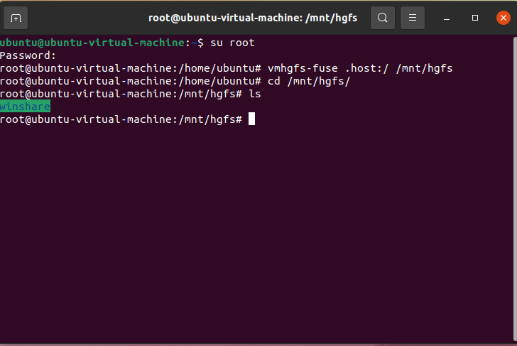
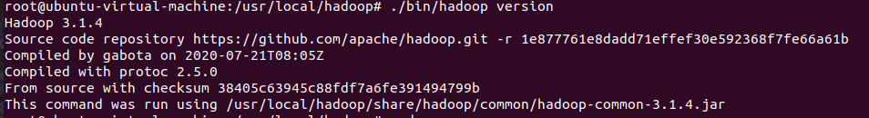

# Ubuntu虚拟机配置Hadoop

>已通过`VMware`安装好`Ubuntu`系统，并且安装过`vmware tools`

## 1.设置虚拟机和电脑之间的共享文件夹

在自己电脑上新建一个文件夹，命名为`winshare`，将需要在`Ubuntu`系统上使用的文件放入`winshare`中


打开设置，创建共享文件夹


创建完成之后，进入`Ubuntu`系统，在`/mnt/hgfs`中可以找到所创建的共享文件夹`winshare`

>如果`/mnt/hgfs`下没有文件显示，检查是否安装`vmware tools`。
>
>如果安装了还是无法显示，切换成`root`用户，执行下列命令（注意：每次开机后查看共享文件夹，都需要重新执行该命令）
>
>```shell
>root@ubuntu-virtual-machine:~# vmhgfs-fuse .host:/ /mnt/hgfs 
>```



## 2.`Ubuntu`安装`jdk`

1.在`/usr/local`下新建一个文件夹`java`，并将`jdk`压缩包解压到该目录下

```shell
#新建java文件夹
mkdir /usr/local/java

#解压jdk压缩包
tar -zxvf /mnt/hgfs/winshare/jdk-8u281-linux-x64.tar.gz -C /usr/local/java/
```

2.配置环境变量

```shell
vim ~/.bashrc
```

在文件末尾加入下列内容：（注意自己`jdk`的版本）

```shell
export JAVA_HOME=/usr/local/java/jdk1.8.0_281
export JRE_HOME=${JAVA_HOME}/jre
exportCLASSPATH=.:${JAVA_HOME}/lib:${JRE_HOME}/lib
export PATH=${JAVA_HOME}/bin:$PATH
```

3.刷新环境变量

```shell
source ~/.bashrc
```

4.查看是否配置成功

```shell
java -version
javac
```

## 3.设置`ssh`

1.下载`ssh`

```shell
sudo apt install openssh-server
```

2.测试连接

```shell
ssh localhost
```

输入密码，查看是否连接成功

若一直显示`Permission denied`，切换至`root`用户再次尝试，若依旧显示，修改`ssh`配置文件，设置为允许远程登陆

```shell
vim /etc/ssh/sshd_config
```

将下面的`PermitRootLogin Prohibit-password`去掉注释，并修改为`PermitRootLogin yes`


保存并退出，重启`ssh`服务

```shell
/etc/init.d/ssh restart
```

3.设置`ssh`无密码登陆

生成公钥

```shell
ssh-keygen -t rsa -P ''
```

将公钥发送到需要免密登录的机器的`~/.ssh/authorized_keys`目录下

```shell
cat ~/.ssh/id_rsa.pub >> ~/.ssh/authorized_keys
```

此时输入`ssh localhost`，如果不需要密码就能进行访问，说明设置成功

## 4.创建`Hadoop`用户

1.创建一个名为`hadoop`的用户

```shell
sudo useradd –m hadoop –s /bin/bash
```

2.上面的命令创建了可以登陆的`hadoop`用户，并使用`/bin/bash`作为`shell`接着使用如下命令设置密码

```shell
sudo passwd hadoop
```

3.为`hadoop`用户增加管理员权限

```shell
sudo adduser hadoop sudo
```

## 5.`Hadoop`单机安装

1.解压安装包

```shell
sudo tar -zxvf /mnt/hgfs/winshare/hadoop-3.1.4.tar.gz -C /usr/local/
```

2.重命名`hadoop`

```shell
mv hadoop-3.1.4/ hadoop
```

3.修改文件权限

```shell
sudo chown -R hadoop:hadoop ./hadoop/
```

4.修改`/usr/local/hadoop/etc/hadoop/hadoop-env.sh`文件以配置`hadoop`运行的环境变量

```shell
vim /usr/local/hadoop/etc/hadoop/hadoop-env.sh
```

在该文件中添加`jdk`信息

```shell
export JAVA_HOME=/usr/local/java/jdk1.8.0_281
```

5.添加完成后，进入`usr/local/hadoop`目录下，输入下列命令查看`hadoop`的版本信息

```shell
./bin/hadoop version
```



> 给`hadoop`配置全局环境变量
>
> ```shell
> vim ~/.bashrc
> ```
>
> 将下面的代码添加到该文件末尾
>
> ```shell
> export HADOOP_HOME=/usr/local/hadoop
> export CLASSPATH=$($HADOOP_HOME/bin/hadoop classpath):$CLASSPATH
> export HADOOP_COMMON_LIB_NATIVE_DIR=$HADOOP_HOME/lib/native
> export PATH=$PATH:$HADOOP_HOME/bin:$HADOOP_HOME/sbin
> ```
>
> 刷新环境变量
>
> ```shell
> source ~/.bashrc
> ```
>
> 查看版本
>
> ```shell
> hadoop version
> ```

6.测试例子

`Hadoop`默认模式为非分布式模式（本地模式），无需进行其他配置即可运行。非分布式即单`Java`进程，方便进行调试。

运行`WordCount`的例子，将`input`文件夹中的所有文件作为输入，筛选当中符合正则表达式`dfs[a-z.]+`的单词并统计出现的次数，最后输出结果到`output`文件夹中。

```shell
cd /usr/local/hadoop
#在上述目录下创建input文件夹
mkdir ./input

#将/usr/local/hadoop/etc/hadoop文件夹下的配置文件拷贝进input文件夹下
cp ./etc/hadoop/*.xml ./input

#在hadoop目录下新建output文件夹，用来存放输出数据
./bin/hadoop jar ./share/hadoop/mapreduce/hadoop-mapreduce-examples-*.jar grep ./input ./output 'dfs[a-z.]+'

#查看输出数据的内容
cat ./output/*
#输出内容为"1	dfsadmin"，意思为在所有的配置文件中，只有一个符合正则表达式的单词

#hadoop默认不会覆盖结果文件，因此再次运行上面实例会提示出错，需要先将output文件夹删除
rm -r ./output/
```


## 6.`Hadoop`伪分布式配置

> 下列`core-site.xml`和`hdfs-site.xml`配置文件在`/usr/local/hadoop/etc/hadoop`路径下

1. 配置`core-site.xml`文件

   ```shell
   vim core-site.xml
   ```
   
   在`<configuration></configuration>`标签中添加下列代码
```xml
<configuration>
    <property>
         <name>hadoop.tmp.dir</name>
         <value>file:/usr/local/hadoop/tmp</value>
         <description>Abase for other temporary directories.</description>
    </property>
    <property>
         <name>fs.defaultFS</name>
         <value>hdfs://localhost:9000</value>
    </property>
</configuration>
```

2. 配置`hdfs-site.xml`文件

   ```shell
   vim hdfs-site.xml
   ```
   
   在`<configuration></configuration>`标签中添加下列代码

```xml
<configuration>
    <property>
         <name>dfs.replication</name>
         <value>1</value>
    </property>
    <property>
         <name>dfs.namenode.name.dir</name>
         <value>file:/usr/local/hadoop/tmp/dfs/name</value>
    </property>
    <property>
         <name>dfs.datanode.data.dir</name>
         <value>file:/usr/local/hadoop/tmp/dfs/data</value>
    </property>
  </configuration>
```

3.格式化`namenode`节点

在`/usr/local/hadoop`目录下执行下列命令

```
./bin/hdfs namenode -format
```

4.启动`Hadoop`

在`/usr/local/hadoop`目录下执行下列命令

```
./sbin/start-dfs.sh
```

5.通过`jps`命令查看是否启动成功


6.通过`Web`界面`http:localhost:9870`查看`NameNode`和`DataNode`的信息

> 从Hadoop 3.0开始端口配置发生了变化，使用Hadoop3.0以前的版本需要访问`http://localhost:50070`

