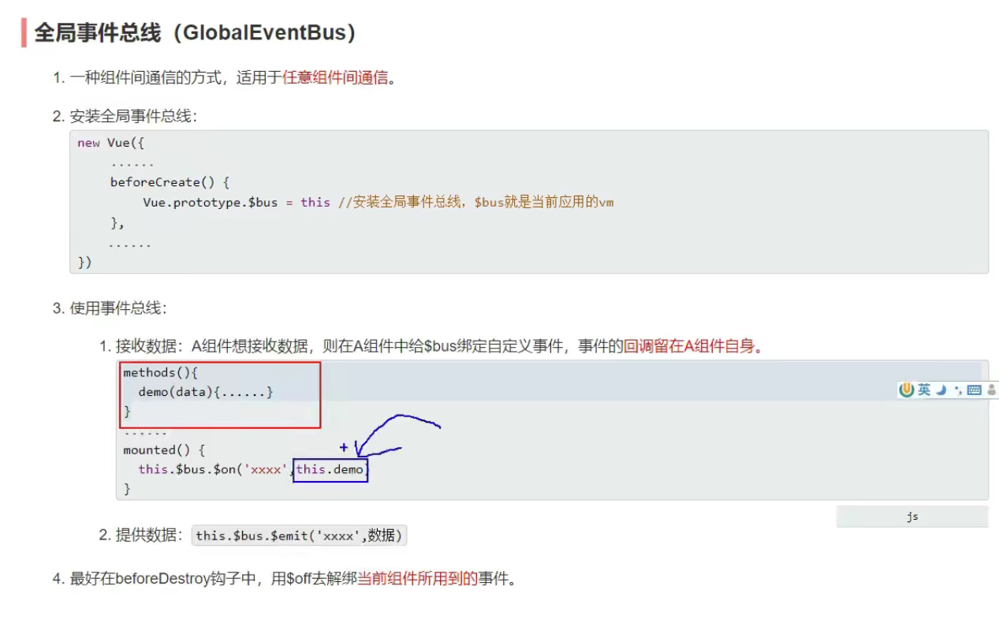
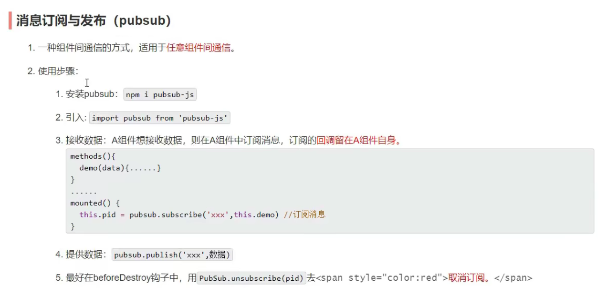

# vue基础学习

## 1.Vue Devtools（解决一个警告）

在谷歌应用商店搜索vue.js devtools

## 2.安装vue

开发版本和生产版本

## 3.解决（警告问题）

```html
   <script type="text/javascript">
       Vue.config.productionTip = false
   </script>
```

## 4.页签图标放在根目录下，不用引用

强制更新，Shift+刷新

## 5.模板语法

插值语法与指令语法

> 插值语法：
>
> 功能：用于解析标签体内容
>
> 写法：`{{xxx}}`,xxx是js表达式，且可以直接读取到data中的所有属性

> 指令语法：
>
> 功能：用于解析标签（包括：标签属性、标签体内容、绑定事件......）
>
> 举例：`v-band:href="xxx"`简写为`:href="xxx",xxx同样要xeijs表达式

## 6.数据绑定

插值语法

指令语法：

单项数据绑定和双向数据绑定

```vue
v-bind:value      :value
v-model:value     v-model
```

## 7.`el`与`data`的两种写法

`el`的两种写法

```js
el:'#root'

x.$mount('#root') //更灵活,可以延时显现
```

`data`的两种写法

```js
//第一种写法：对象式
new Vue({
        el:'#root',
        data:{ 
                name:"lucy"
        }
    })
      
//第二种写法：函数式
new Vue({
        el:'#root',
        data:function(){ //可以删掉:function
            console.log('@@@',this)  //此处this是vue实例对象
            return{
                name:"lucy"
            }
        }
    })
```

## 8.`MVVM`模型

> M：模型（Model）：对应data中的数据
>
> V：视图（View）：模板
>
> VM：视图模型（ViewModel）：Vue实例对象


> 观察发现：
>
> 1.data中所有的属性，最后都出现在vm身上
>
> 2.vm身上所有的属性及vue原型上所有属性，在vue模板中都可以直接使用

## 9.数据代理

概念：

```html
<!DOCTYPE html>
<html lang="zh-CN">
<head>
    <meta charset="UTF-8">
    <meta http-equiv="X-UA-Compatible" content="IE=edge">
    <meta name="viewport" content="width=device-width, initial-scale=1.0">
    <title>回顾Object.defineproperty方法</title>
</head>
<body>
    <script type="text/javascript">
        let number = 18
        let person = {
            name:'张三',
            sex:'男',
            // age:'18',
        }

        Object.defineProperty(person, 'age', {
            // value:18,
            // enumerable:true,  //控制属性是否可以枚举，默认值是false
            // writable:true,    //控制属性是否可以被修改，默认值是false
            // configurable:true,//控制属性是否可以被删除，默认值是false

            //当有人读取person的age属性时，get(getter)函数就会被调用，且返回值就是age的值
            get(){
                console.log('有人读取age属性')
                return number
            },

            //当有人修改person的age属性时，set(setter)函数就会被调用，且会收到修改的具体值
            set(value){
                console.log('有人修改了age属性值', value)
                number = value
            }

        })

        console.log(person)

        console.log(Object.keys(person))
        for (let key in person){
            console.log('as',person[key])
        }
    </script>
</body>
</html>
```

```html
<!DOCTYPE html>
<html lang="zh-CN">
<head>
    <meta charset="UTF-8">
    <meta http-equiv="X-UA-Compatible" content="IE=edge">
    <meta name="viewport" content="width=device-width, initial-scale=1.0">
    <title>数据代理定义</title>
</head>
<body>
    <!-- 数据代理：通过一个对象对另一个对象中属性的操作（读/写） -->
    <script type="text/javascript">
        let obj1 = {
            x:100
        }

        let obj2 = {
            y:200
        }

        Object.defineProperty(obj2, 'x', {
            get(){
                return obj1.x
            },

            set(value){
                obj1.x = value
            }
        })
    </script>
</body>
</html>
```

vue中数据代理的应用：


> vue中数据代理：
>
> 通过vm对象来代理data对象中属性的操作（读/写）
>
> vue中数据代理的好处：
>
> 更加方便的操作data中的数据
>
> 基本原理：
>
> 通过Object.defineProperty()把data对象中所有属性添加到vm上
>
> 为每一个添加到vm上的属性，都指定一个getter/setter
>
> 在getter/setter内部去操作（读/写）data中对应的属性

## 10.事件

事件处理

> 1.使用`v-on:xxx`或`@xxx`绑定事件，其中xxx是事件名
>
> 2.事件的回调需要配置在methods对象中，最终会在vm上
>
> 3.methods中配置的函数，不要用箭头函数，否则this就不是vm
>
> 4.methods中配置的函数，都是被vue所管理的函数，this的指向是vm或组件实例对象
>
> 5.`@click="demo"`和`@click="demo($event)"`效果一致，但后者可以传参

事件修饰符

> 1.prevent：阻止默认事件（常用）
>
> 2.stop：阻止事件冒泡（常用）
>
> 3.once：事件只触发一次（常用）
>
> 4.capture：使用事件的捕获模式
>
> 5.self：只有event.target是当前操作的元素时才是触发事件
>
> 6.passive：事件的默认行为立即执行，无需等待事件回调执行完毕

```
@scroll="demo" //滚动条滚动事件
@wheel="demo"  //滚轮滚动是事件
```

键盘事件

> 1.vue中常用的按键别名
>
> - 回车：enter
> - 删除：delete（捕获删除和退格键）
> - 推出：esc
> - 空格：space
> - 换行：tab（特殊，必须配合keydown去使用）
> - 上：up
> - 下：down
> - 左：left
> - 右：right
>
> 2.vue未提供别名的按键，可以使用按键原始的key值去绑定，但注意要转为kebab-case（短横线命名）
>
> 3.系统修饰键（用法特殊）：ctrl,alt,shift,meta
>
> （1）配合keyup使用：按下修饰键的同时，再按下其他键，随后释放其他键，事件才触发
>
> （2）配合keydown使用：正常触发事件
>
> 4.也可以使用keyCode去指定具体的按键（不推荐）
>
> 5.Vue.config.keyCodes.自定义键名 = 键码，可以去定制按键别名

## 11.计算属性

> 1.定义：要用的属性不存在，要通过已有的属性计算得来
>
> 2.原理：底层借助了Object.defineproperty方法提供的getter和setter方法
>
> 3.get函数什么时候执行：
>
> - 初次读取数据时会执行一次
> - 当依赖的数据发生变化时会被再次调用
>
> 4.优势：与methods实现相比，内部有缓存机制（复用），效率更高，调试方便
>
> 5.备注：
>
> 计算属性最终会出现在vm上，直接读取即可使用
>
> 如果计算属性要被修改，那必须写set函数去响应修改，且set中要引起计算依赖的数据发生改变

## 12.条件渲染和列表渲染

条件渲染

v-show  适用于变化频率高

v-if         适用于频率低

> v-else-if

template  只能配合v-if，不能和v-show一起使用

使用v-if时，元素可能无法获取到，v-show一定可以获取到

使用时结构不能被打断

列表渲染

遍历数组或对象，或字符串，指定次数

```html
<li v-for="p in persons" :key="p.id">{{p.name}}-{{p.age}}</li>
<li v-for="(p, index) in persons" :key="p.id">{{p.name}}-{{p.age}}</li>
<li v-for="(p, index) of persons" :key="p.id">{{p.name}}-{{p.age}}</li>
<li v-for="p in str" :key="p.id">{{p.name}}-{{p.age}}</li>
<li v-for="p in 5" :key="p.id">{{p.name}}-{{p.age}}</li>
```

## 13.收集表单数据

> 若：`<input type="text"/>`，则`v-model`收集的是`value`值，用户输入的就是`value`值
>
> 若：`<input type="radio"/>`，则`v-model`收集的是`value`值，且要给标签配置`value`值
>
> 若：`<input type="checkbox"/>`
>
> 1. 没有配置`input`的`value`属性，那么收集的就是`checked`(勾选 or 未勾选， 是布尔值)
> 2. 配置`input`的`value`值：
>
> - `v-model`的初始值是非数组，那么收集的就是`checked`
> - `v-model`的初始值是数组，那么收集的就是`value`组成的数组
>
> 备注：`v-model`的三个修饰符：
>
> - `lazy`：失去焦点再收集数据
> - `number`：输入字符串转为有效数字
> - `trim`输入内容首位空格过滤

## 14.过滤器

定义：对要显示的数据进行特定格式化后再显示（适用于一些简单逻辑的处理）

语法：

1. 注册过滤器：`Vue.filter(name,callback)`或`new Vue{filters:{}}`
2. 使用过滤器：`{{xxx | 过滤名}}`或`v-bind:属性 = "xxx | 过滤名"`

备注：

1. 过滤器也可以接收额外参数，多个过滤器也可以串联
2. 并没有改变原本的数据，是产生新的对应数据

## 15.内置指令

`v-bind`单向绑定解析表达式，可简写为`:xxx`

`v-model`：双向数据绑定

`v-for`：遍历数组/对象/字符串

`v-on`：绑定时间监听，可简写为@

`v-if`：条件渲染（动态控制节点是否存在）

`v-else`：条件渲染（动态控制节点是否存在）

`v-show`：条件渲染（动态渲染节点是否展示）

`v-text`：向其所在的节点中渲染文本内容，与插值语法的区别：`v-text`会替换节点中的内容，`{{xxx}}`则不会

`v-html`：

1. 作用：向指定节点中渲染包含html结构的内容

2. 与插值语法的区别：

   `v-html`会替换掉节点中的所有内容，`{{xxx}}`则不会

   `v-html`可以识别`html`结构

3. 严重注意：`v-html`有安全性问题

   在网站上动态渲染任意HTML是非常危险的，容易导致XSS攻击

   一定要在可信的内容上使用v-html，永远不要用在用户提交的内容上

`v-cloak`指令：没有值

- 本质是一个特殊属性，Vue实例创建完毕并接管容器后，会删掉`v-cloak`属性
- 使用`css`配合`v-cloak`可以解决网速慢时页面展示出`{{xx}}`的问题

`v-once`指令：

- `v-once`所在节点在初次动态渲染后，就视为静态内容了
- 以后数据的改变不会引起`v-once`所在结构的更新，可以用于优化性能

`v-pre`指令：

- 跳过其所在节点的编译过程
- 用在：没有使用指令语法、没有使用插值语法的节点，会加快编译

## 16.自定义指令：

1.定义语法：

局部指令：

```js
new Vue({
    directives:{指令名， 配置对象}
})

或

new Vue({
    directives{指令名， 回调函数}
})
```

全局指令：

```js
Vue.directive(指令名， 配置对象)
或
Vue.directive(指令名， 回调函数)
```

2.配置对象中常用的3个问题

- `bind`:指令与元素成功绑定时调用
- `inserted`:指令所在元素被插入页面时调用
- `update`:指令所在模板结构被重新解析时调用

3.备注：

- 指令定义时不加`v-`，但使用时要加`v-`
- 指令名如果是多个单词，要使用`kebab-case`命名方式，不要用`camelCase`命名


## 17.生命周期

- 又名：生命周期回调函数、生命周期函数、生命周期钩子
- 定义：Vue在关键时刻帮我们调用的一些特殊名称的函数
- 生命周期函数的名字不可更改，但函数的具体内容是程序员根据需求编写的
- 生命周期函数中的this指向是vm或组件实例对象

第一次放入叫挂载，之后叫更新


耦合性：模块之间信息或参数依赖的程度

内聚性：与耦合性相对的概念，表示内部间聚集、关联的程度

低耦合是结构良好程序的特性

高内聚低耦合

复用和复制

## 18非单文件组件.

> 组件
>
> 定义：实现应用中局部功能代码和资源的集合(html/css/js/image)
>
> 为什么：一个界面的功能很复杂
>
> 作用：复用编码，简化新项目编码，提供运行效率

> 模块：
>
> 理解：向外提供特定功能的`js`程序，一般就是一个`js`文件
>
> 为什么：`js`文件很多很复杂
>
> 作用：复用`js`，简化`js`的编写，提高`js`运行效率

> 模块化：当应用中的`js`都以模块来编写，那这个应用就是一个模块化的应用
>
> 组件化：当应用中的功能都是多组件的方式来编写的，那这个应用就是一个组件化的应用

非单文件组件：一个文件中包含n个组件

单文件组件：一个文件中只包含个组件（推荐）

>过滤器：filters:{}
>
>自定义指令：directives:{}
>
>组件：components:{}


`Vue`中使用组件的三大步骤：

一、定义组件（创建组件）

> 使用`Vue.extend(options)`创建，其中`options`和`new Vue(options)`时传入的那个`options`几乎一样，但区别如下：
>
> `el`不要写：最终所有的组件都要经过一个`vm`管理，由`vm`中的`el`决定服务哪个容器
>
> `data`必须写成函数：避免组件被复用时，数据存在引用关系

备注：使用`template`可以配置组件结构

二、注册组件

- 局部注册：依靠`new Vue`的时候传入`components`选项
- 全局注册：依靠`Vue.component('组件名', 组件)

三、使用组件（写组件标签）

```html
<school></school>
```

注意点：

> 关于组件名：
>
> 一个单词组成：
>
> - 第一种写法（首字母小写）：school
> - 第二种写法（首字母大写）：School
>
> 多个单词组成：
>
> - 第一种写法(kebab-case命名)：my-school
> - 第二种写法(CamelCase命名)：MySchool(需要Vue脚手架支持)
>
> 备注：
>
> - 组件名尽可能回避HTML中已有的元素名称，例如：`h2`,`H2`都不行
> - 可以使用`name`配置项指定组件在开发工具中呈现的名字

> 关于组件标签：
>
> ```html
> # 第一种写法：
> <school></school>
> 
> # 第二种写法
> <school/>
> ```
>
> 备注：不使用脚手架时，`<school/>`会导致后续组件不能渲染

一个简写方式：

```js
const school = Vue.extend(options)
// 可简写为
const school = options
```


>关于VueComponent:：
>
>1.school组件本质是一个名为VueComponent的构造函数，且不是程序员定义的，是Vue.extend生成的
>
>2.我们只需要写`<school/>`或`<school></school>`，Vue解析时会帮我们创建school组件的实例对象，即Vue帮我们执行：new VueComponent(options)
>
>3.特别注意，每次调用Vue.extend,返回的都是一个全新的VueCommpoent
>
>4.关于this指向：
>
>组件配置中：data函数、method中的函数、watch中的函数、computed中的函数，它们的this均是【VueComponent实例对象】
>
>new Vue(options)配置中：data函数、method中的函数、watch中的函数、computed中的函数，它们的this均是【Vue实例对象】
>
>5.VueComponent的实例对象简称vc(组件实例对象)，Vue的实例对象简称vm

## 19.单文件组件

```vue
<template>
  组件的结构
</template>

<script>
export default {
组件交互相关的代码（数据、方法等）
}
</script>

<style>
组件的样式
</style>
```

## 20.Vue脚手架

Vue CLI  

 CLI:command line interface命令行接口工具

```shell
# 1.仅第一次执行：全局安装@vue/cli
npm install -g @vue/cli

# 2.切换到需要创建项目的目录，然后使用命令创建项目
vue create ****

# 3.启动项目
npm run server

# 配置npm淘宝镜像
npm config set registry https://registry.npm.taobao.org

# Vue脚手架隐藏了所有webpack相关的配置，若想查看具体的webpakc配置，执行下列命令
vue inspect > output.js
```

> 关于不同版本的Vue:
>
> 1.vue.js与vue.runtime.***.js的区别：
>
> - vue.js是完整版的vue，包含：核心功能+模板解析器
> - vue.runtime.***.js是运行版的Vue，只包含：核心功能，没有模板解析器
>
> 2.因为vue.runtime.***.js没有模板解析器，所以不能使用template配置项，需要使用render函数接受到的createElement函数去指定具体内容

## 21.ref属性：

1.被用来给元素或子组件注册引用信息（id的替代名）

2.应用在HTML标签上获取的是真是DOM，应用在组件标签上是组件实例对象（vc）

3.使用方法：

- 打标识：`<h1 ref="***">.....</h1>`或`<School ref="***"></School>`
- 获取：`this.$refs.***`

> 配置项props:
>
> 功能：让组件接收外部传过来的数据
>
> 1.传递数据：
>
> `<Student name="***"/>`
>
> 2.接收数据：
>
> ```js
> // 1.简单声明接收
>  // props:['name','sex','age']
> 
>  // 2.接收的同时对数据进行:类型限制
>  // props:{
>  //     name:String,
>  //     sex:String,
>  //     age:Number
>  // }
> 
>  // 3.接收的同时对数据进行：类型限制+默认值限制+必要性的限制
>  props:{
>      name:{
>          type:String,   //name的类型是字符串
>          required:true  //name是必要的
>      },
>      sex:{
>          type:String,
>          required:true
>      },
>      age:{
>          type:Number,
>          default:99
>      }
>  }
> 
> }
> ```
>
> 备注：props是只读的，Vue底层会监测你对props的修改，如果进行了修改，就会发出警告，若业务需求确实需要修改，那么请复制props中的内容到data中一份，然后去修改data中的数据

## 22.scoped样式：

> 作用：让样式在局部生效，防止冲突
>
> 写法：`<style scoped>`

## 23.webStoryage

> 1.存储内容大小一般支持5M左右（不同浏览器不一样）
>
> 2.浏览器端通过Windows.sessionStorage和Window.localStorage属性来实现本地存储机制
>
> 3.相关API：
>
> ```js
> // 该方法接受一个键和值作为参数，会把键值对添加到存储中，如果键名存在，则更新其对应的值
> xxxxxStorage.setItem('key', 'value');
> ```
>
> ```js
> //该方法接受一个键名作为参数，返回键名对应的值
> xxxxxStorage.getItem('key', 'value');
> ```
>
> ```js
> // 该方法接受一个键名作为参数，并把该键名从存储中删除
> xxxxxStorage.removeItem('key', 'value');
> ```
>
> ```js
> // 该方法会清空存储中的所有数据
> xxxxxStorage.clear('key', 'value');
> ```
>
> 4.备注：
>
> SessionStorage存储的内容会随着浏览器窗口关闭而消失
>
> LocalStorage存储的内容，需要手动清除才会消失
>
> xxxStorage.getItem(xxx),如果xxx对应的value获取不到，那么getItem的返回值是null
>
> JSON.parse(null)的结果依然是null

## 24.组件的自定义事件（绑定和解绑）


## 25.全局事件总线




## 26.消息订阅与发布




