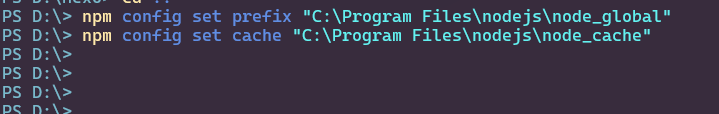
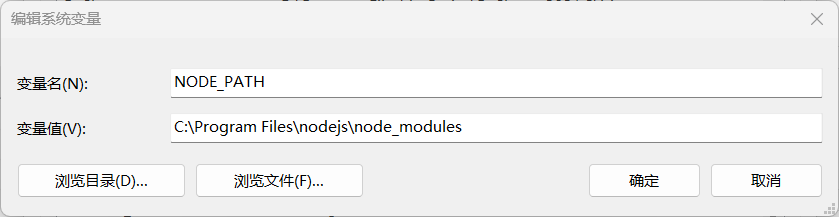
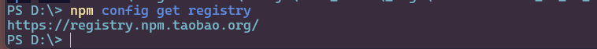
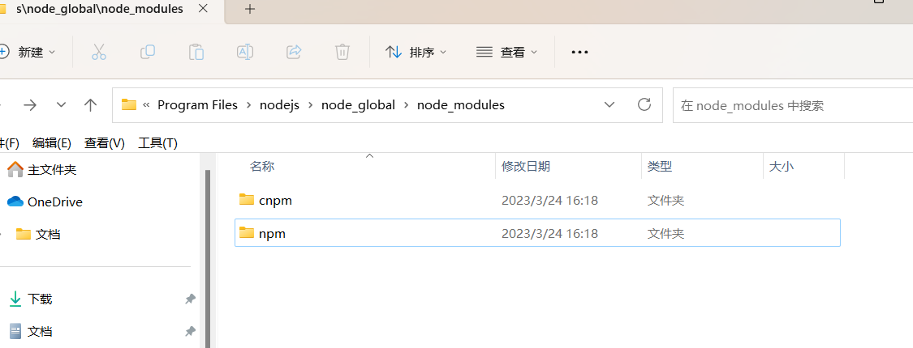

> `npm`（`Node Package Manager`）是`Node.js`的包管理器，随同`NodeJS`一起安装的包管理和分发工具，它很方便让`JavaScript`开发者下载、安装、上传以及管理已经安装的包。

> `npm`由三个独立的部分组成：网站，注册表(`registry`)，命令行工具(`CLI`）。
>
> - 使用该网站来发现包、设置配置文件并管理您的` npm `体验的其他方面。例如，您可以设置[组织](https:node与npm/node与npm/www.npmjs.comnode与npm/features)来管理对公共或私人包的访问
>- `CLI`从终端运行，是大多数开发人员与` npm` 交互的方式。
> - 注册表是` JavaScript `软件及其周围元信息的大型公共数据库。

> `npm`是随同`NodeJS`一起安装的包管理工具，能解决`NodeJS`代码部署上的很多问题，常见的使用场景有以下几种：
>
> - 允许用户从`NPM`服务器下载别人编写的第三方包到本地使用。
> - 允许用户从`NPM`服务器下载并安装别人编写的命令行程序到本地使用。
> - 允许用户将自己编写的包或命令行程序上传到`NPM`服务器供别人使用。

# 卸载`Node`

1. 打开控制面板，卸载`Node`

2. 删除`Node`的安装目录`D:\Program Files\nodejs`

3. 查找`.npmrc`文件是否存在，有就删除(默认在`C:\User\用户名`下)

4. 逐一查看以下文件是否存在，存在就删除

   - `C:\Program Files (x86)\[Nodejs`

   - `C:\Program Files\Nodejs`

   - `C:\Users\用户名\AppData\Roaming\npm`

   - `C:\Users\用户名\AppData\Roaming\npm-cache`

5. 编辑系统环境变量，将用户变量、系统变量里的node删掉

6. 输入`node -v`查看是否删除成功

# 安装`node`

1.去官网下载`https://nodejs.cn/download/`


2.双击安装

3.验证安装


# 修改全局路径

1.在`C:\Program Files\nodejs`下新建两个文件夹`node_global`及`node_cache`

2.打开命令行输入



- prefix = 创建的node_global文件夹所在路径
- cache  = 创建的node_cache文件夹所在路径

3.修改系统环境变量

- 打开**用户变量**下的`Path`，将原本的内容修改为`C:\Program Files\nodejs\node_global`


- 在**系统变量**下新建`NODE_PATH`，`C:\Program Files\nodejs\node_modules`



- 打开**系统变量**下的`Path`，新建`node`全局文件夹`C:\Program Files\nodejs\node_global`


> 验证：
>
> 经过上述步骤，`nodejs`下载的模块就会自动下载到自定义的目录，如输入
>
> ```shell
> npm install express -g       # -g是全局安装的意思，不加-g就是默认下载到当前目录
> ```
>
> 可以在`C:\Program Files\nodejs\node_global\node_modules`下看到下载成功的`express`

> 注意：若执行`npm`出现如下报错
>
> 
>
> 由于权限原因，选择`nodejs`文件夹，右键->属性->安全，点击编辑，将所有权限都打开即可
>
> 

# 更换`npm`源为淘宝镜像

> 说明：
>
> `npm`默认的`registry`是国外的服务器，很慢，一般更换国内的

1.查看初始`npm`源

```shell
npm config get registry
```


2.更换镜像为淘宝镜像

```shell
npm config set registry https://registry.npm.taobao.org/
```

3.检查配置是否成功

```shell
npm config get registry
```



# 全局安装基于淘宝源的`cnpm`

>`npm`与`cnpm`的区别：
>
>`npm`是`node`官方的包管理器，`cnpm`是中国版的`npm`，是淘宝定制的`cnpm`命令行工具，代替默认的`npm`
>
>如果因网络原因无法使用`npm`下载，那么就可以使用`cnpm`
>
>一般`cnpm`只用于安装，所以在项目创建与卸载等相关操作时还是使用`npm`

1.全局安装基于淘宝源的`cnpm`

```shell
npm install -g cnpm --registry=https://registry.npm.taobao.org
```

2.下载完成后，我们在本地就能看到`cnpm`模块



3.执行命令`cnpm -v`查看`cnpm`是否安装成功


如图即配置成功，若遇到报红，可关闭命令行，再重新打开
