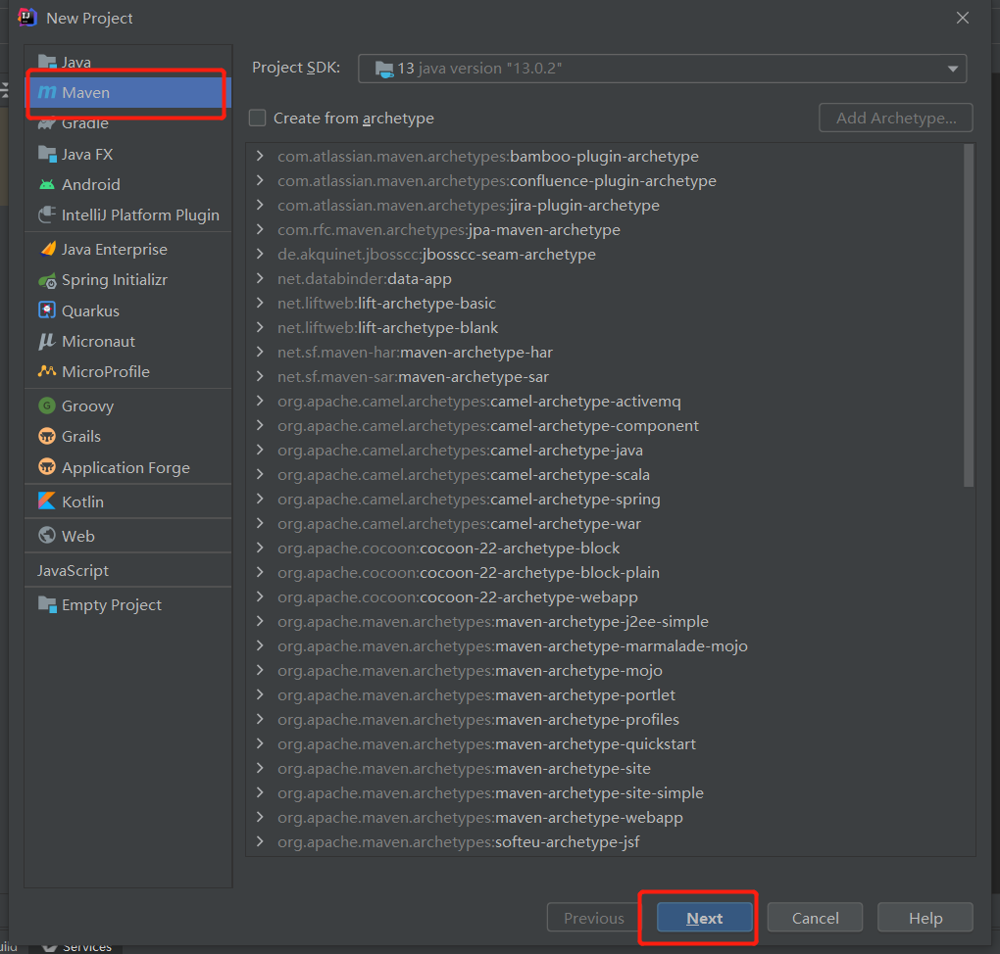
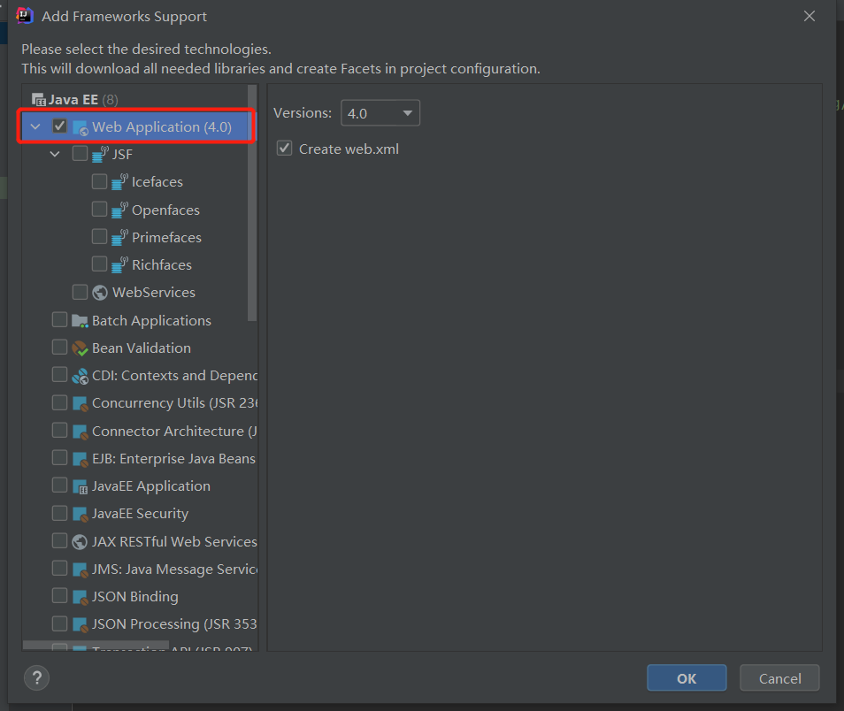
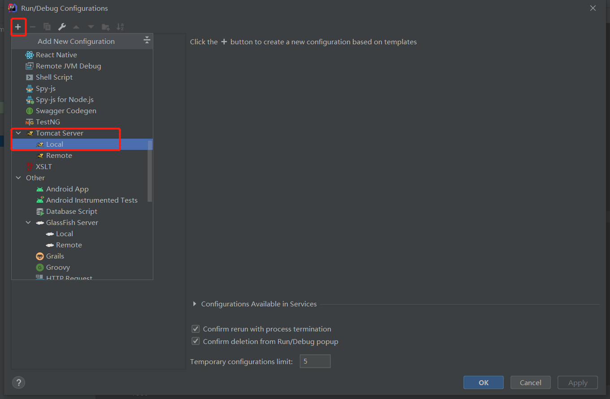
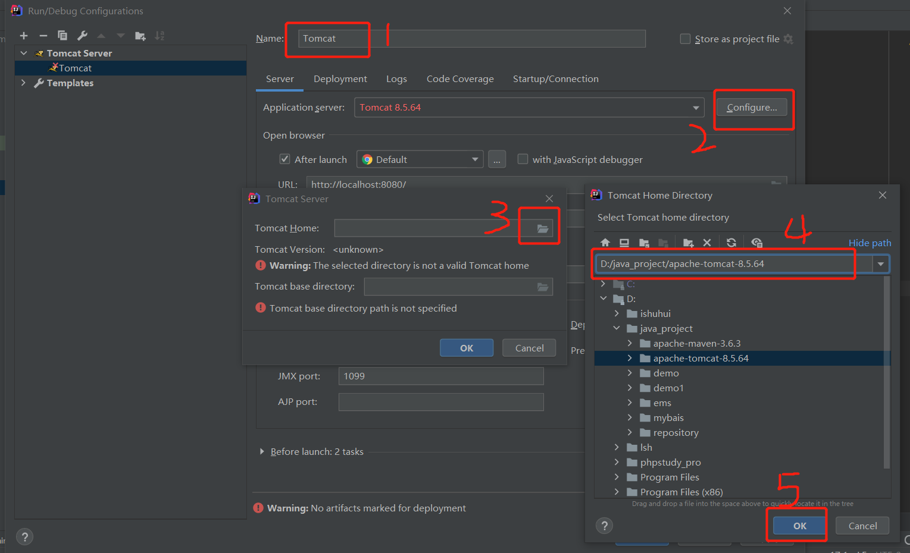
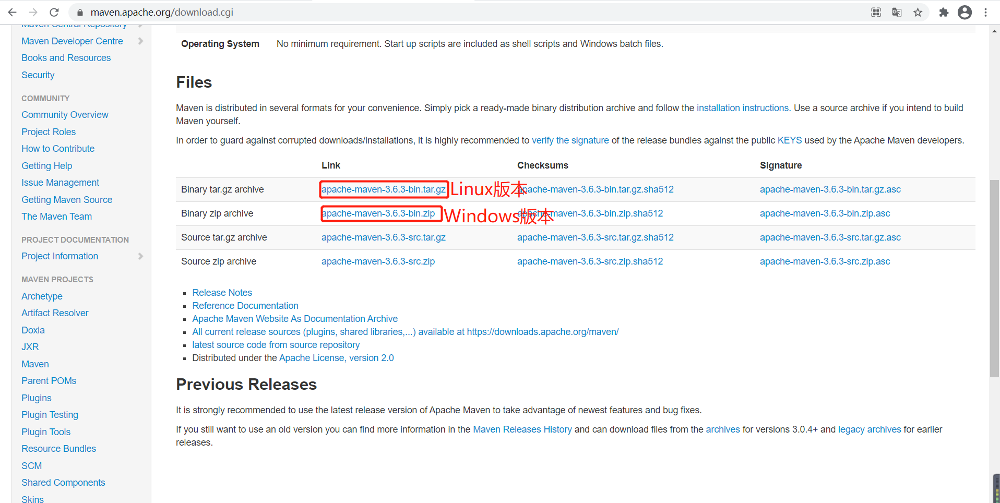
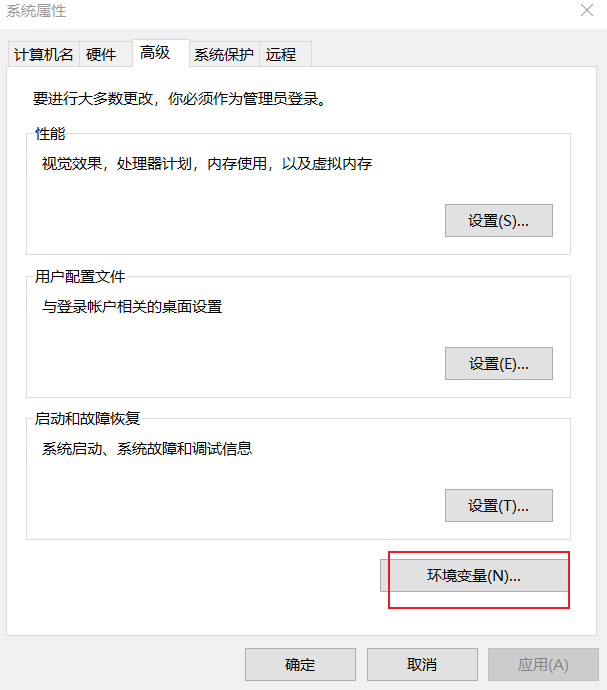
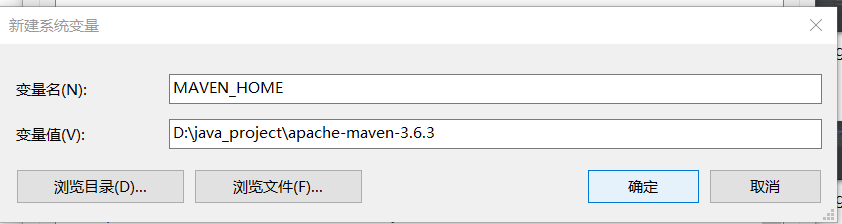
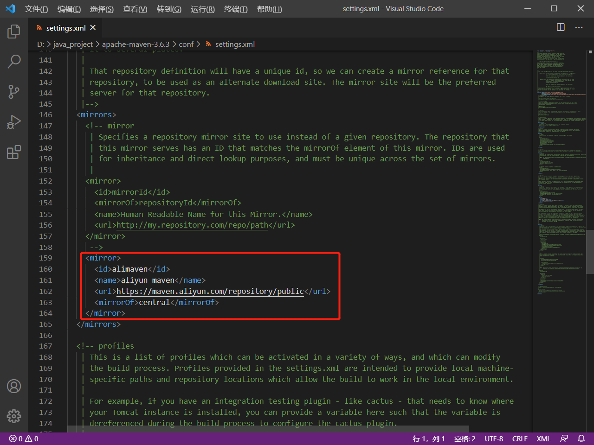
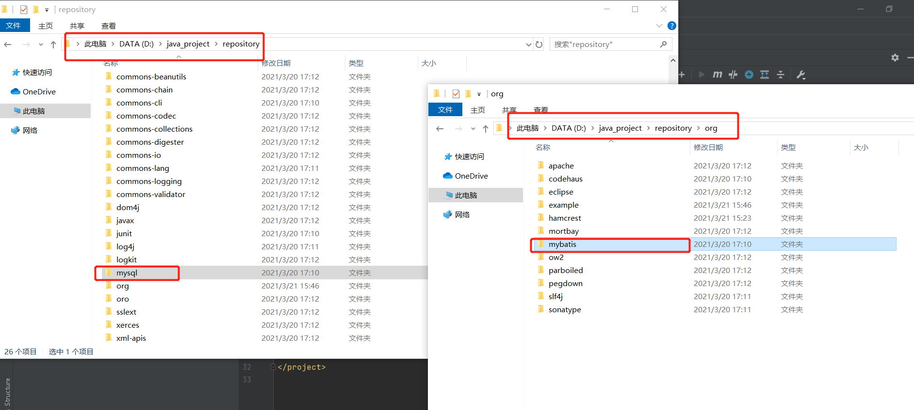

## idea新建项目

打开idea新建工程


选择Maven，点击Next



将新建的工程放到D盘java_project这个文件夹下，并取名demo1,点击Finish


建好后会生成一个pom.xml文件，可在里面放入需要加载的依赖


然后找到刚刚建的项目demo1，鼠标右击选择Add Framework Support


勾选Web Application,点击OK



选完后会生成一个web文件夹，里面的index.jsp文件在配置完Tomcat后会在浏览器在显示


## 配置Tomcat

下载解压Tomcat到合适的目录下（我的放在D盘java_Project文件夹下）。

点击Run，并点击Edit Configurations


点击左上角的加号，并选择Tomcat Server下的Local(切记不要选成TomEE Server)





然后点击OK，出现红色警告时，点击右边的Fix


然后回到主页面，点击运行Tomcat,默认浏览器将会显示index.jsp中的内容，表示Tomcat配置成功


## 配置Maven

从官网下载Maven，地址为`https://maven.apache.org/download.cgi`



下载并解压Maven到合适的目录，（我的放在D盘java_project文件下）

配置Maven的环境变量

打开环境变量



新建系统变量



找到`Path`，点击新建，输入`%MAVEN_HOME%\bin`，然后点几次确定


打开命令行，输入mvn -v 查看版本以及是否安装成功


找到maven下的conf，打开setting.xml文件


找到mirrors，并在里面添加如下代码，最后保存并关掉



```xml
<mirror>
      <id>alimaven</id>
      <name>aliyun maven</name>
      <url>https://maven.aliyun.com/repository/public</url>
      <mirrorOf>central</mirrorOf> 
    </mirror>
```

打开idea,File-->Settings修改下面的路径（可以选择不修改）


打开pom文件，添加一些需要使用的依赖，代码可从`https://mvnrepository.com/`中找到使用最多的版本复制粘贴。

若出现红色的报错点击右侧的刷新。


下载后可在刚刚设置的本地仓库中找到刚刚下载的mysql和mybatis（若没有更改则在C盘.m2文件夹下）



